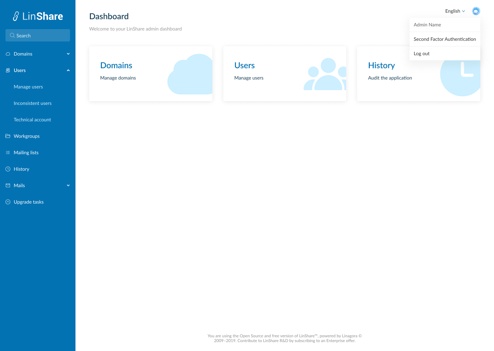
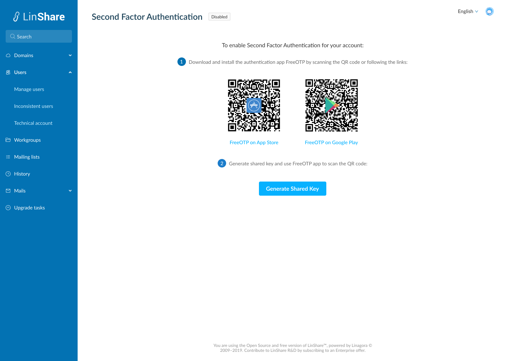
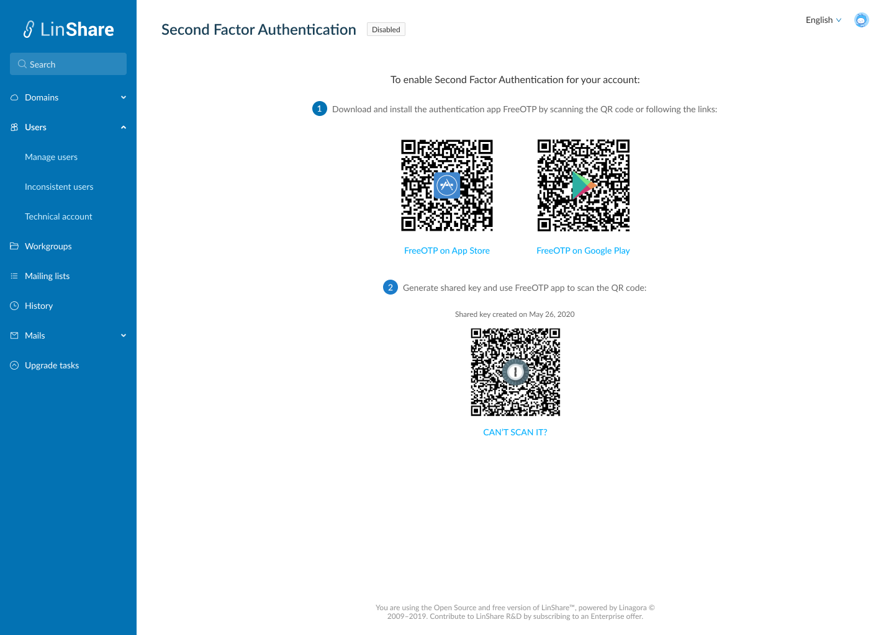
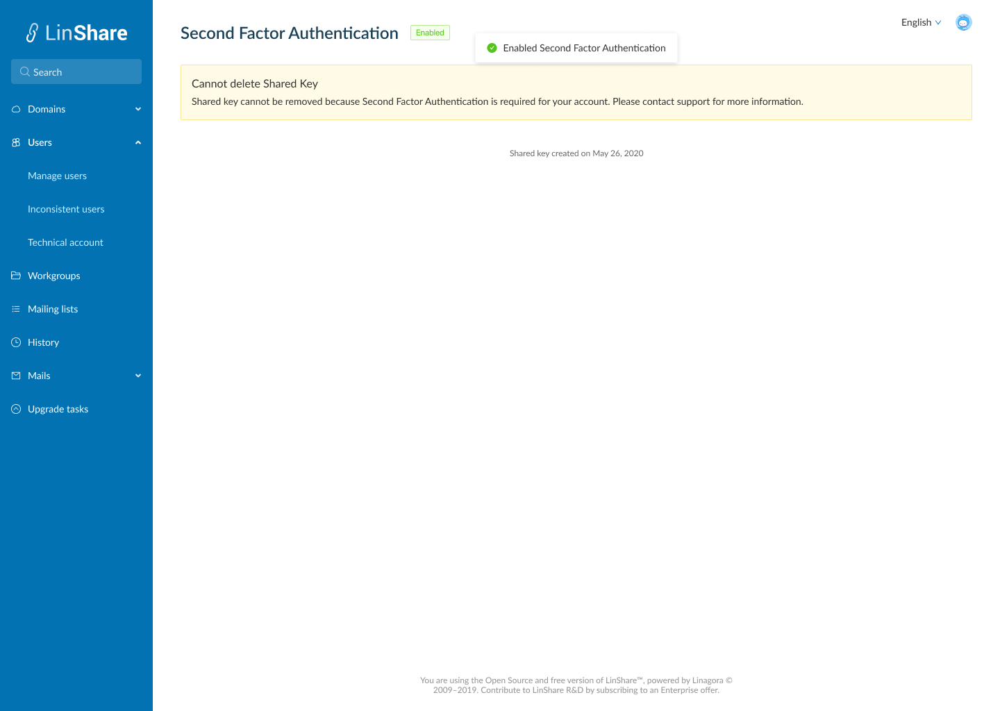

# Summary

* [Related EPIC](#related-epic)
* [Definition](#definition)
* [Screenshots](#screenshots)
* [Misc](#misc)

## Related EPIC

* [New admin portal](./README.md)

## Definition

#### Preconditions

  Given that am an admin and also a normal Linshare user
*  Given that Admin functionalities enabled 2FA and my 2FA has not been setup (Setting 2FA can be done in both User UI or Admin UI)

#### Description

*  After log-in to Admin UI, i click on  human icon the right corner  
*  I click on Second factor authentication, 2FA set-up page will be opened. 
*  If the Admin functionalities make 2FA usage required for my domain, after log-in Admin UI, i am redirected to 2FA set-up page and i cannot go to other page without setting 2FA. 
*  I can see the the 2FA status is disabled.  
*  In this view, I can see 2 steps to enable 2FA 
   *  Step 1: Download and install the authentication app Free OTP. I can click the links or scan QR code to 
download app from Apple store and Google play.
   *  Step 2 : In the next step, I click button Add Shared key,  a QR code will be generated by LinShare server
 and displayed.
*  I open FreeOTP app on my device and scan this QR code. I can see my account in the list account screen of the
 app,  including information: issuer + account. Issuer is "Linshare" and account is user'email. 

#### Postconditions

*  The FreeOTP app will start to generate random token – a 6digits-code.
*  This code will be changed and invalid after each 30 seconds. 
*  Now if i refresh page, i can not see the QR code. Depend on setting: 
   *  If admin functionalities allow me to remove shared key, screen 4 will be displayed. If not, screen 5 will be displayed. 

**Note: If i enabled 2FA on Admin UI, it is also enabled on User UI. When i try to access UI user now, i am required to input 6-digits code to authenticate**

[Back to Summary](#summary)

## UI Design

#### Mockups
#### Final design

Screen 1

Screen 2

Screen 3

Screen 4

Screen 5

[Back to Summary](#summary)
## Misc

[Back to Summary](#summary)
