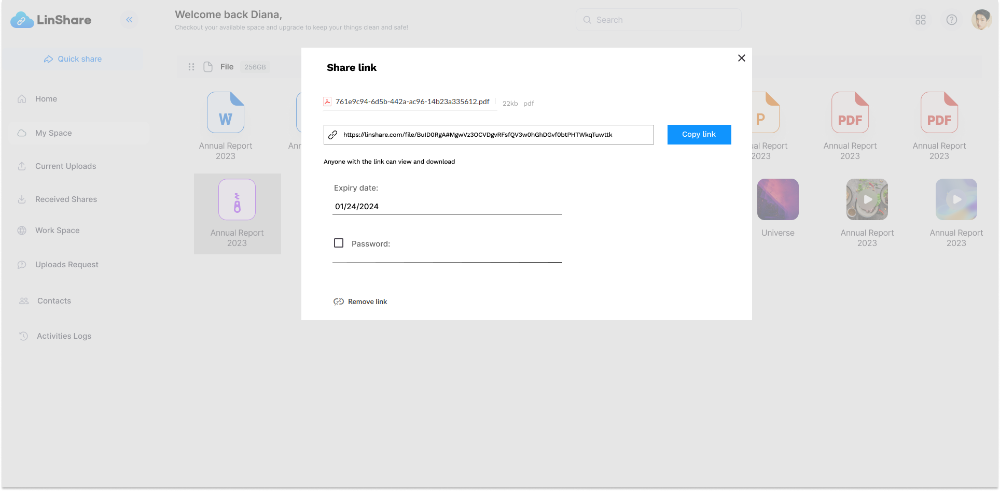

# Summary

* [Related EPIC](#related-epic)
* [Definition](#definition)
* [UI Design](#ui-design)
* [Misc](#misc)

## Related EPIC

* [New UI user](./README.md)

## Definition

### Preconditions

- Given that I am logged into my account

### Description 

**UC1. As a LinShare user, I can share the file by link**
- I open MySpace and see the list of files 
- I click on 3-dots button of a file and hover option Share
- Then I can see 2 types of share: Share by email or Share link 
- If I select Share by email, then the share screen is opened as currently 
- If I select Share link, a popup will be opened and I can see:
   - File information : File name, file size and file format 
   - A link of file: There is a button Copy next to the link. When I select this button, the file link is copied to my clipboard. I can send this link to the person tht I want to share the file 
   - Expiration date: This field's value is set default by admin and I can changed the date 
   - Password: When I select the checkbox, a password will be automatically generated by system I can change it (?)
- When I closed the popup, there will be a "Shared" icon on this file.
- I can see a button "Remove link" at the bottom of the popup. If I select this button, the share link will be deleted and the shared icon disappeared on this file. 
- The share link is removed automatically on its expiry date. 

**UC2. Receiver can view adn download file from a share link**
- Given that I received a share link by LinShare user 
- I open that link on my browser 
- If the share link is expied, I can see a notification message 
- If the share link is secured by a password, I can see a screen that asked me to input password
- After I input correct password, I am redirected to the shared file. 
- I can see the preview of file (if any) and a download button
- When I click download button, the file is downloaded to my device 

### Postcondition 

[Back to Summary](#summary)

## UI Design

### Mockups

### Final design

[Back to Summary](#summary)

## Misc

[Back to Summary](#summary)

