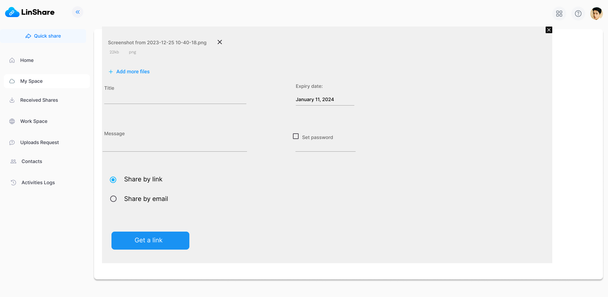
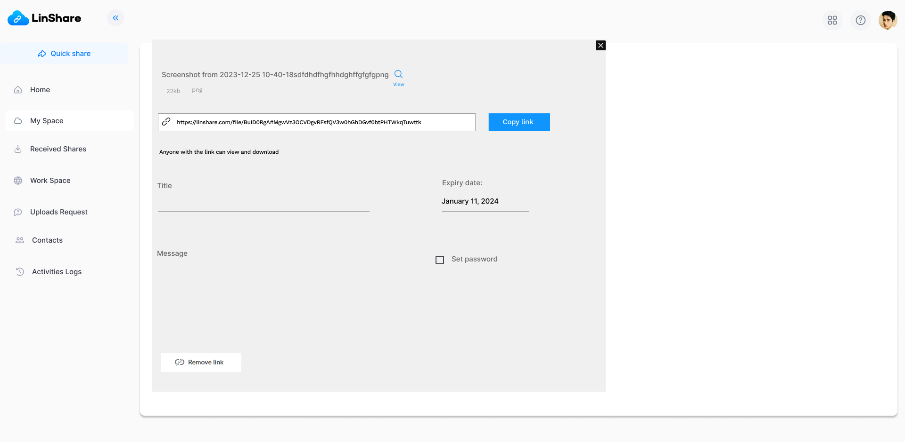
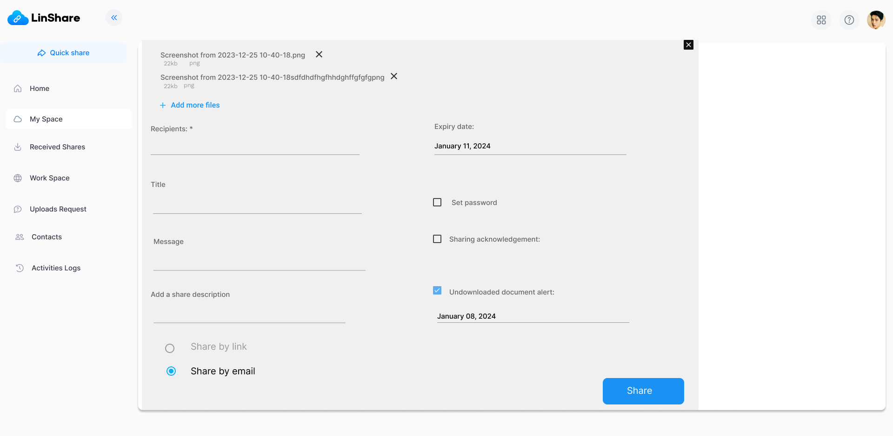

# Summary

* [Related EPIC](#related-epic)
* [Definition](#definition)
* [UI Design](#ui-design)
* [Misc](#misc)

## Related EPIC

* [New UI user](./README.md)

## Definition

### Preconditions

- Given that I am LinShare user I have logged into my account

### Description 

- When I select "Quick share" on left menu, a new screen will be opened.
- On this quick share  widget, I can see a button "Upload files and share"
- When I click this button, the file browser is opened and I can select file to upload:
   - If I upload one file, I can select share by link or share by email 
   - If I upload multiple files, the option "share by link" is disabled. User can only share multiple files via emails. (At the first step we only support share by link for single file. User can archive multiple files locally and upload it as one file."

**UC1. Share file by link**
- I select one file to upload. When the upload is finished, I can see file information:
   - File name 
   - File size
   - File type
- And the close button next to each file to remove 
- I can select one of 2 options: Share by link or Share by email 
- If I select option Share by link, then the button "Get a link" is displayed below. 
- I can input fields (non-mandatory):
   - Title: A text field 
   - Message: A text fiels
   - Expiry date: Default date is set by admin and user can change this date if the admin setting allows
   - Password: When I select the checkbox, then the a password will be automatically generated by system I can change it (?)
- I click button "Get a link", then the system will genertate a link and display it below the file name with a Copy button 
- I can copy the link and share to other people 
- I can see a button "Remove link" at the bottom of the popup. If I select this button, the share link will be deleted.
- There is button "View" next to the shared file. When I click this button, I am redirected to Myspace and the shared file is  highlited (selected). There will be a "Shared" icon on this file.

**UC2. Share file (s) by email**
- After select file and upload, I can see file information including:
   - File name 
   - File size
   - File type
- And the close button next to each file to remove 
- I can click "Add more files" to upload additional files 
- I select option "Share by email". (If I uploaded multiple file, the default option is "Share by email" and I can not select "Share by link")
- I can input fields:
   - Recipients: Mandatory field.  When I input some characters, the system will display auto-complete suggestions. I can input multiple email addresses to this field. 
   - Expiration date: The default date will be set by admin. I can change the expiration date If admin allows to change 
   - Email subject: A text field 
   - Enter your email message: A text field 
   - Add a share descrption: A text field 
   - Set password: A checkbox. If I select this checkbox, the receiver will receive a password in the sharing email and he needs to input this password to access the dhared files 
   - Sharing acknowledgement: A checkbox. If I select this checkbox, I will receive an mail about this share 
   - Undownloaded document alert: A checkbox. IF I select this checkbox, the field Notification for undownloaded file is displayed below. I can select a date. On that date, if the shared file has not been downloaded, I will receive a notification email. 
- After input field, I click button Share. There will be a successful toast message:"Your files were successfully sent." and button "View"
- When I click "view", , I am redirected to Myspace and the shared file is  highlited (selected). There will be a "Shared" icon on this file.

### Postcondition 

[Back to Summary](#summary)

## UI Design

### Mockups

### Final design

[Back to Summary](#summary)

## Misc

[Back to Summary](#summary)

