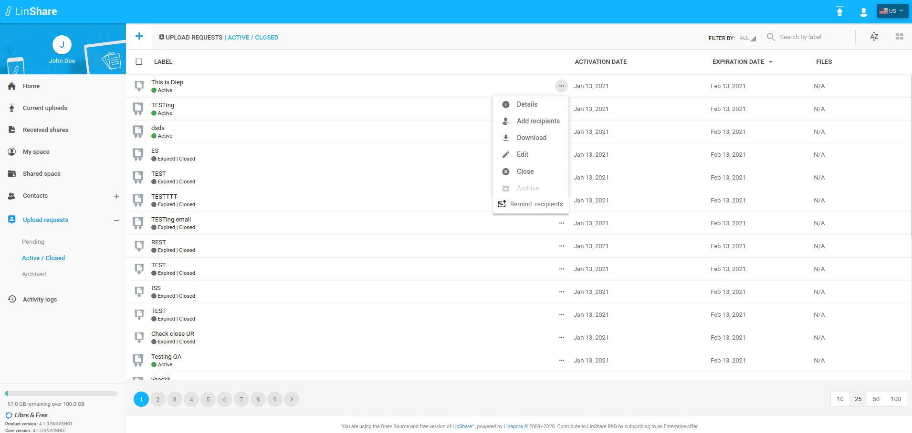
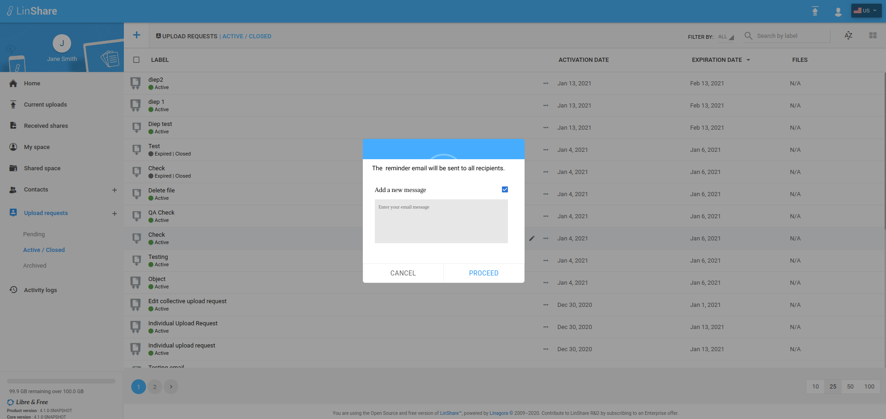
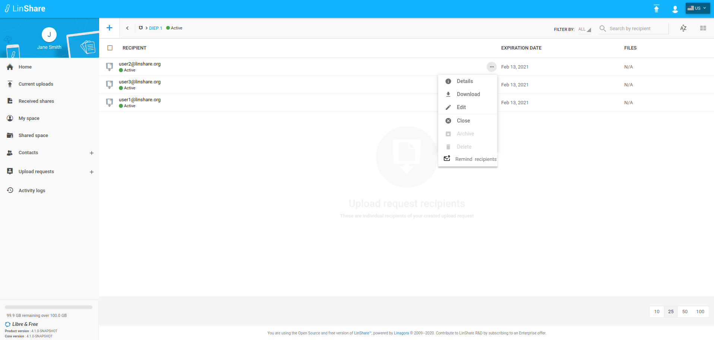
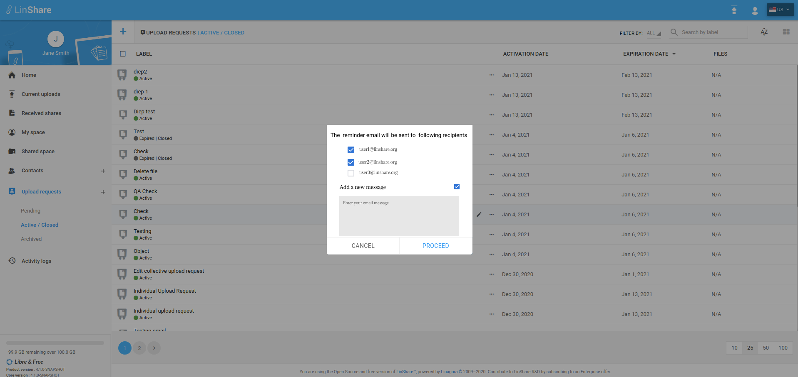
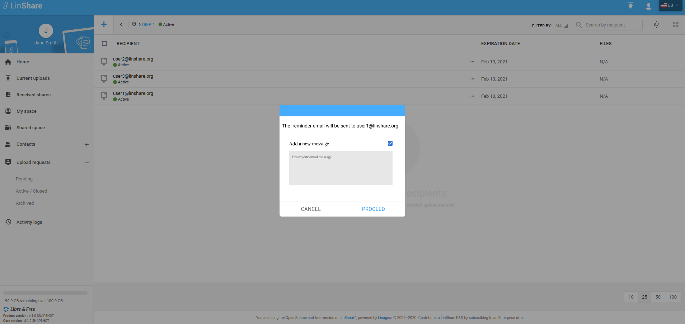

# Summary

* [Related EPIC](#related-epic)
* [Definition](#definition)
* [Screenshots](#screenshots)
* [Misc](#misc)

## Related EPIC

* [Upload Request](./README.md)

## Definition

#### Preconditions
*  Given that i am an Linshare user
*  Given that domain admin enabled reminder email activation policy. 
#### Description
### UC1 Remind recipients of collective Upload request
 
*  From menu, i go to screen List active/closed UR 
*  On an active collective Upload request, when i click on three-dot button, i can see option "Remind recipients"
*  When i click on button Remind recipient, a popup will be appeared: 
   *  In the popup, i can see the sentence "The  reminder email will be sent to all recipients." and a  checkbox "Add a new message". When i tick this box, a text field will be displayed and i can input the new message. This message (if any) will be sent in the reminder email.
*  When i click button Proceed on popup, the system will send a reminder email to all recipients of the collective UR. 
*  Reminder Mail content is configured in Admin UI: When the recipient open the mail, he can see mail content and a button Access. When he click on Access button, his Upload Request Portal will be opened. 
### UC2 Remind recipients of individual Upload request 

*  From menu, i go to screen List active/closed UR 
*  On an active individual Upload request, when i click on three-dot button, i can see option "Remind recipients"
*  When i click on button Remind recipient, a popup will be appeared: 
   *  In the popup, i can see the sentence "The  reminder email will be sent to following recipients." the list pf recipients will be dislplayed. I can tick/untick the checkbox next to each recipients. There is also a checkbox "Add a new message". When i tick this box, a text field will be displayed and i can input the new message. This message (if any) will be sent in the reminder email.
*  When i click button Proceed on popup, the system will send a reminder email to all selected recipients 
*  Reminder Mail content is configured in Admin UI: When the recipient open the mail, he can see mail content and a button Access. When he click on Access button, his Upload Request Portal will be opened. 

### UC3 Remind a recipient of a nested upload request

*  From menu, i go to screen List active/closed UR 
*  When i click on an active individual upload request, the list of nested upload request screen is opened. 
*  I click on three-dot button of an nested UR, i can see the option "Remind recipient"  
*  When i choose option Remind recipient, a popup will be displayed. 
  *  In the popup, i can see the sentence "The  reminder email will be sent to [recipient email]." and a  checkbox "Add a new message". When i tick this box, a text field will be displayed and i can input the new message. This message (if any) will be sent in the reminder email.
*  If i choose Proceed to confirm, the system will send a reminder email to selected recipient.
*  Reminder Mail content is configured in Admin UI:  When the recipient open the mail, he can see mail content and a button Access. When he click on Access button, his Upload Request Portal will be opened. 

[Back to Summary](#summary)

## UI Design

#### Mockups
**1.1 Remind recipients - UR list**

**1.2 Popup - Collective UR**

**1.3 Remind one recipient- nested UR**

**1.4 Popup - Individual UR**

**1.5 Popup - Nested UR**

#### Final design

[Back to Summary](#summary)
## Misc

[Back to Summary](#summary)
