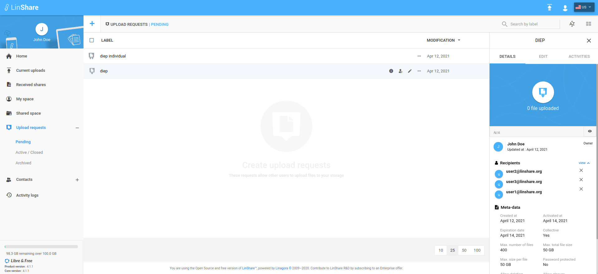
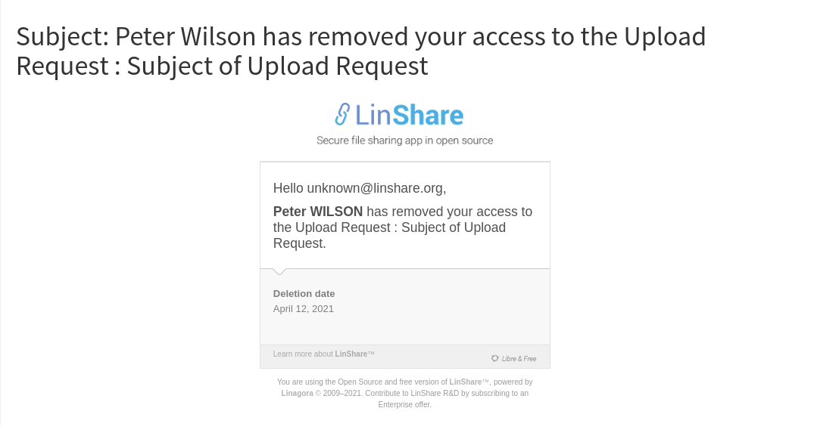

# Summary

* [Related EPIC](#related-epic)
* [Definition](#definition)
* [Screenshots](#screenshots)
* [Misc](#misc)

## Related EPIC

* [Upload-Request](./README.md)

## Definition

#### Preconditions

* Given that functionality "Upload request" is enabled in Admin
* Given that i am an issuer of Upload  request
* Given that email notification for Remove recipient is enabled in Admin

#### Description

* I log-in the system successfully and from the left menu, I choose Upload request, I can
 see the second-level menu including:

        - Created: Listing URs that have status “Created”
        - Active+Closed: Listing Urs that have status Active or Closed
        - Archived: Listing Urs that have status Archived
* In UR list screen, I click on three-dot button of a pending/active UR, the drop-down list will be displayed.
* If the UR is collective, i can see the option Remove recipient that when i click on, the right panel "Details" will appear.
* In "Details" Panel, i can see the recpipient list.
*  Beside every recipient,  i can see the delete icon that when i click on, a confirmation popup will be displayed: "You are about to remove a recipient from this upload request! All files uploaded by this recipient will be also removed.  Beware, this action cannot be undone."
*  I choose Yes to confirm, the recipient will be removed and system will display message :" [Selected recipicent's email] has been removed successfully from the Upload request"

#### Postconditions

* If the UR is collective and status is Pending, after removing recipient, he will be removed from the Recipient list
* If the UR is collective and status is Active, after removing recipient, his uploaded files will be removed also.
* The removed recipient will receive email notification.
* Now when recipient tries to access UR, he will see an error page 404.

[Back to Summary](#summary)

## UI Design

#### Mockups

#### Final design

[Back to Summary](#summary)
## Misc

[Back to Summary](#summary)
