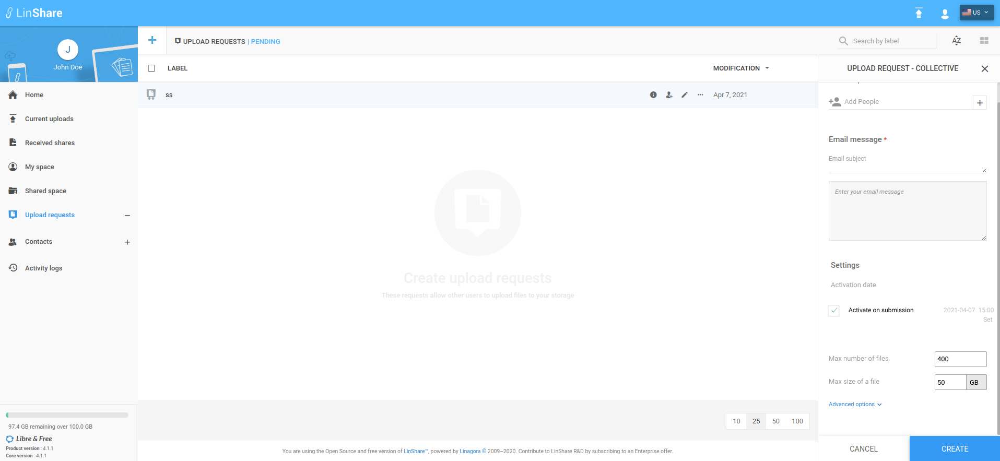

# Summary

* [Related EPIC](#related-epic)
* [Definition](#definition)
* [Screenshots](#screenshots)
* [Misc](#misc)

## Related EPIC

* [Upload-request](./README.md)

## Definition

#### Current behavior

*  When creating upload request, we have 3 date/time fields:
   * Activation date 
   * Expiration date
   * Reminder date 
*  With each date/time fields, there will be an default hour = current hour +1
*  Under default hour, there will be an button "Set" that when i click on, there will be an hour picker that allow me to choose hour from 1=> 24. Now the button "Set" change to "Remove"
*  If i click button Remove, the hour will be reset to "current hour"+1
*  Currently, when i do not change default value of activation date, and click button Create, if other fields are valid, the UR will be activated immediately. 
*  If i choose an activation hour <= current hour, there will be an error message from server

#### Improvement 

**Activation date**
*  If default value of activation date is creation date, when i open Create UR form, on Activation date field, i can see a checkbox : Activate on submission ticked by default.  
    *  If Delegation policy is enabled, i can untick the checkbox, the button Set is enabled and then i can click button Set to choose activation Date/hour. 
    *  If delegation policy is disabled, i cannot unctick the checkbox 
*  If default value of activation date is > creation date, when i open Create UR form, on Activation date field, i can see the default value date with default hour = current hour +1
    *  If Delegation policy is enabled, i can tick the checkbox to activate UR on creation. The date/hour picker will be disabled now. 
    *  If delegation policy is disabled, i cannot tick the checkbox. 
*  When the Delegation is disabled, hour picker will be disabled also. 
*  When i click button Create, if other fields are valid, and the activation date is today but hour is < current hour, system will display error message: "Please choose the hour between [next hour] and 23"

**Expiry date**
*  Expiry date will be > activation date at least 1 day. When expiry date is </= activation date, there will be an error message below the field.
*  Default hour in Expiry date field is current hour +1 and when delegation policy is enabled, i can click button Set to choose expiry date/hour. 
*  When the Delegation is disabled, hour picker will be disabled also. 
*  When in Edit UR screen, and current date > creation date +1,  i can choose expiry date = today but i choose hour <= current hour, system will display error message: "Please choose the hour between [next hour] and 23"
**Reminder date**
*  When the Delegation is disabled, hour picker will be disabled also. 
*  Default hour in Expiry date field is current hour +1 and when delegation policy is enabled, i can click button Set to choose expiry date/hour. 
*  When Reminder date = today, and i choose hour <= current hour, system will display error message: "Please choose the hour between [next hour] and 23"
[Back to Summary](#summary)

## UI Design

#### Mockups

#### Final design

[Back to Summary](#summary)

## Misc

[Back to Summary](#summary)
