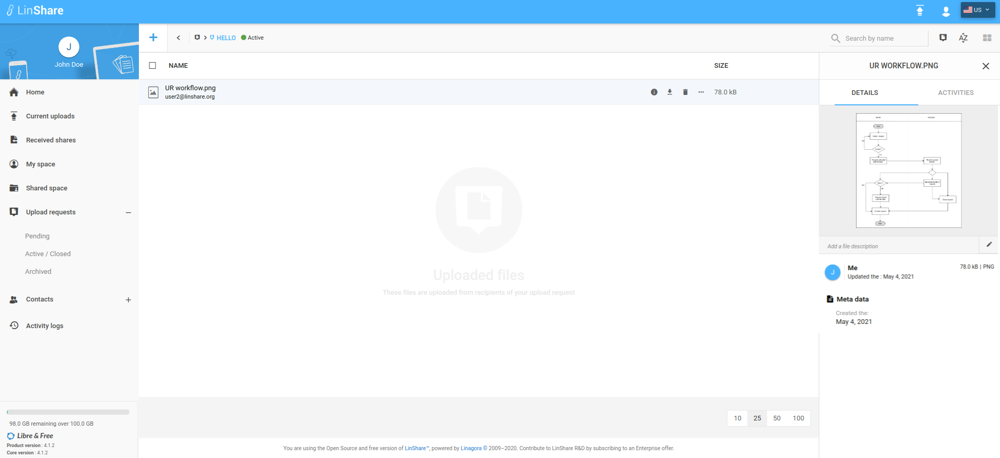
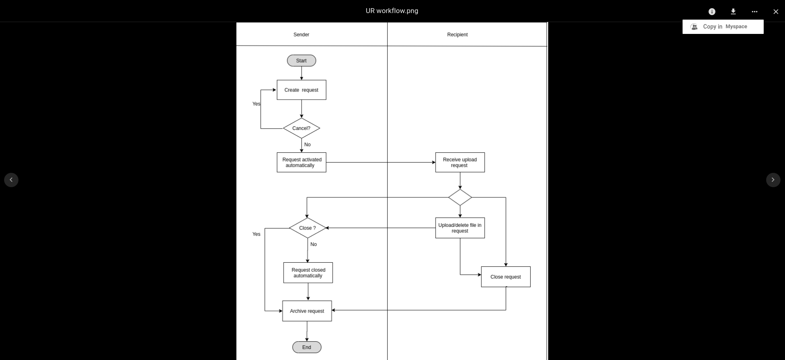
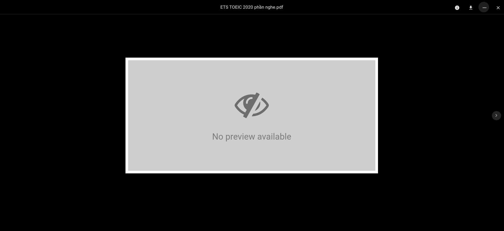

# Summary

* [Related EPIC](#related-epic)
* [Definition](#definition)
* [Screenshots](#screenshots)
* [Misc](#misc)

## Related EPIC

* [Upload request](./README.md)

## Definition
#### Preconditions

- Given that I am a Linshare user 
- Given that Upload request functionality is enabled in Admin

#### Description

- After log-in successfully to Linshare, i go to Upload requests => Active/Closed.
- I can see the list of Upload requests which have status Active or Closed.
- I click on one Upload request and see the list of uploaded files.
- I can see preview of a file in 2 ways:
 1. I click on three-dot button of a file and select the option Preview, the preview page will be displayed. 
2. I click on three-dot button of a file and select the option "Details"
     - The File Details tab will be opened, and i can see thumbnail on the Details section 
     - I click on the thumbnail, the preview page will be displayed.

#### Postconditions

- If the file type is not supported to preview, i can see a page with text: No Preview Available
- If the file type is supported, i can read the file's content.
- On top right of peview page, i can see the options:
    - Details: When i click on, the Details tab will be displayed 
    - Download: When i click on, the downloading will be executed as current process
    - Copy to Myspace: When i click on, the file will be copied to Myspace as current process 

[Back to Summary](#summary)

## UI Design

#### Mockups

Details screen

Preview available

No preview available

#### Final design

[Back to Summary](#summary)
## Misc

[Back to Summary](#summary)
