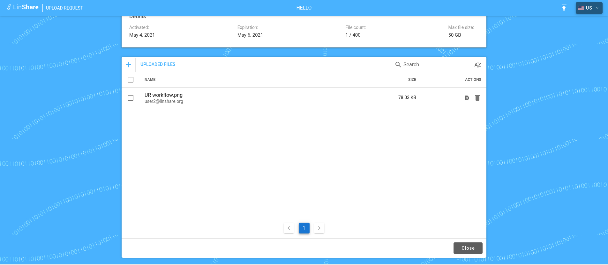

# Summary

* [Related EPIC](#related-epic)
* [Definition](#definition)
* [Screenshots](#screenshots)
* [Misc](#misc)

## Related EPIC

* [Upload request](./README.md)

## Definition

#### Preconditions

- Given that Upload request functionality is enabled in Admin
- Given that I am recipient of an Upload request and the upload request is active or closed (readonly). 

#### Description

- When i access the active upload request portal, i can see the list of files of that upload request.
- I can preview file by 2 ways:
    1. I click on icon Preview in Actions column, the preview page will be displayed.
    2. I click directly on the file name area, the preview page will be displayed.

#### Postconditions

- If the file type is not supported to preview, i can see a page with text: No Preview Available
- If the file type is supported, i can read the file's content.
- On top right of peview page, i can see the options:
    - Download: When i click on, the downloading will be executed as current process

[Back to Summary](#summary)

## UI Design

#### Mockups

#### Final design

[Back to Summary](#summary)
## Misc

[Back to Summary](#summary)
