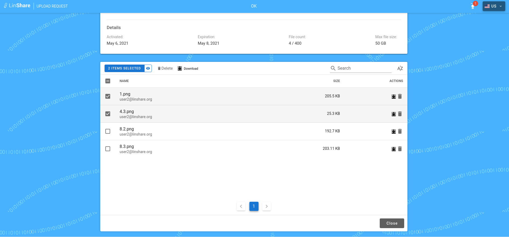

# Summary

* [Related EPIC](#related-epic)
* [Definition](#definition)
* [Screenshots](#screenshots)
* [Misc](#misc)

## Related EPIC

* [Upload request](./README.md)

## Definition

#### Preconditions

- Given that i am recipient of an Upload request.
- I open the upload interface from the link

#### Description

**UC1. As a recipient, I can upload file in my upload request**

- I can only upload file if UR is active
- In the Upload area, I can upload a file by two ways:
     - I click Upload button, the dialog box will be opened and I can choose files from local device to uploaded. 
     - I can drop files to the Upload area
-  When a file is about to be uploaded, the system will validate according to issuer’s request configure as following:
     - If the uploaded file is exceed the max file size, system will display an error message
     - If the max number of files is reached, system will display an error message
     - If the max total file size is reached, system will display an error message
     - If the issuer’s disc space is insufficient, system will display an error message
-  If an selected file passed all above validation, it is uploaded successfully and listed in the area File already uploaded
 with the information: File name, Size
-  If the upload request is collective, all recipients see the same upload request interface, which mean they can see 
others’s uploaded files, and delete them if the issuer allowed. 

**UC2. As a recipient, I can delete file in my upload request**

- I can only delete file if my Upload request is active 
- If the issuer granted me permission to delete uploaded files, I can click the item “Delete” beside the file to delete.
- When a file is uploaded or deleted, the issuer will receive a notification email. This email template is configured in Admin setting. 
- I can select mukltiple files and click button Delete, there will be a confimation message.
- If i choose Yes, all selected files will be removed.

**UC3. As a recipient, i can download files in my upload request**

- I can download files if my Upload request is active or closed. 
- In Upload request, i can see the list of uploaded files. 
- On Action column i can see icon "Download" which when i click on, the selected file will be downloaded to my device.
- I can select multiple files then click button "Download", all the selected file will be downloaded to my device. 

#### Postconditions

[Back to Summary](#summary)

## UI Design

#### Mockups

#### Final design

[Back to Summary](#summary)
## Misc

[Back to Summary](#summary)
