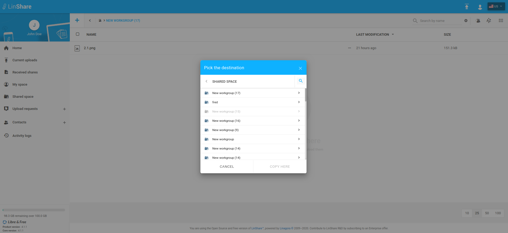

# Summary

* [Related EPIC](#related-epic)
* [Definition](#definition)
* [Screenshots](#screenshots)
* [Misc](#misc)

## Related EPIC

> Links to the epic document in the epic folder, normally README.

* [Workgroups](./README.md)

## Definition

#### Preconditions

- Given that i am LinShare user. 
- Given that Workgroups functionality is enabled in Admin site. 

#### Description

- After logged-in successfully to LinShare, i go to Shared Space and see the list of workgroups 
- I go to a workgroup that i have Copy/move file/folder roles 
- I select one or multiple files/folders to copy/move to Shared Space  
- Or from Myspace screen, i select one or multiple files then copy/move to SharedSpace. 
- A Pick destination screen will be shown and list all the worgkoups that i can copy/move files/folder to 
- When i click on icon Search, a text field will promt below with Place holder "Search by name" and a close button.

#### Postconditions

- If i input text in Search field and the system will display corresponding workgroups which have name  matching searched text.
- If i click on Close button, the Search field will be disappeared. 

[Back to Summary](#summary)

## UI Design

#### Mockups

#### Final design

[Back to Summary](#summary)
## Misc

[Back to Summary](#summary)
