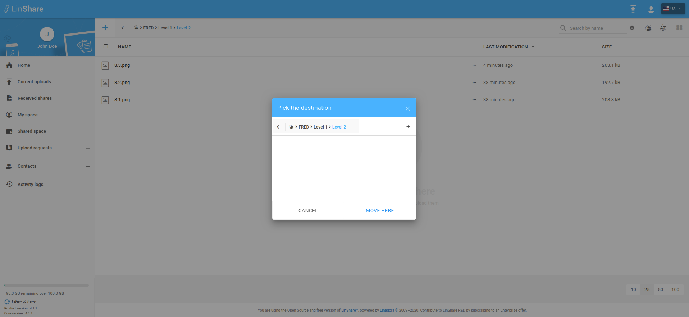

# Summary

* [Related EPIC](#related-epic)
* [Definition](#definition)
* [Screenshots](#screenshots)
* [Misc](#misc)

## Related EPIC

* [Workgroups](./README.md)

## Definition

#### Preconditions

- Given that i am LinShare user. 
- Given that Workgroups functionality is enabled in Admin site. 

#### Description

- After logged-in successfully to LinShare, i go to Shared Space and see the list of workgroups.
- I go to a workgroup that i have Copy/move file/folder roles.
- I select one file/folder to copy/move to Shared Space and click button Copy to Shared space/Move.
- A Pick destination screen will be shown
- In this screen i can see the current folder/workgroup that contains moved file/folder and a breadcumb that show the file/folder's path
- I can click each level in breadcumb to re-select the destination folder/workgroup. 
- Then i can continue copyig/moving file/folder process and normal 
#### Postconditions

- I can see the default Destination screen is showing current directory of the file/folder.

[Back to Summary](#summary)

## UI Design

#### Mockups

#### Final design

[Back to Summary](#summary)
## Misc

[Back to Summary](#summary)
