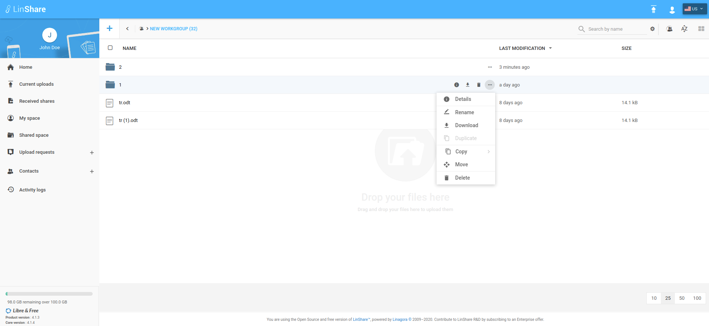
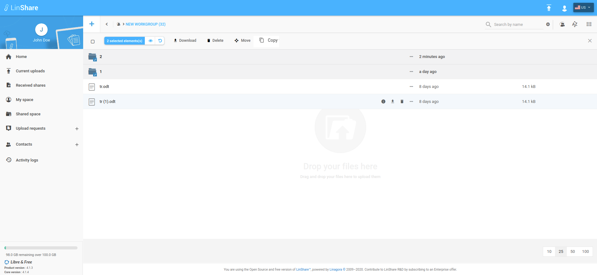
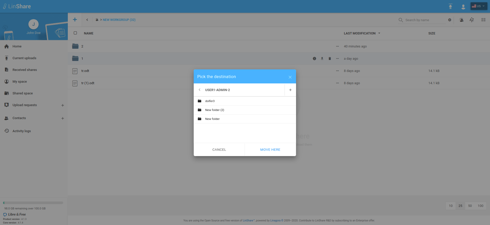

# Summary

* [Related EPIC](#related-epic)
* [Definition](#definition)
* [UI Design](#ui-design)
* [Misc](#misc)

## Related EPIC

> Links to the epic document in the epic folder, normally README.

* [Name of the epic](./README.md)

## Definition

#### Preconditions

- Given that I am a LinShare user.
- Given that "Workgroup" functionality is enabled in Admin.

#### Description

- After logged-in successfully to LinShare, I go to Shared Space and see the list of workgroups
- I go to a workgroup and see the list of files and folders
- I click three-dot button of a folder then select option Copy or Move from dop-down list 
- Or I can tick the checkbox in each folder to select multiple folders, then select option Copy or Move from the action bar 
- A Pick destination screen will be shown and list all the workgroups
- I select a workgroup or select a folder inside a workgroup as destination then click button Copy/Move, the selected folders will be copied/moved to the destination workgroup/folder

#### Postconditions

- In Pick destination screen, only workgroups that I have can copy/move folder permission are enabled.
- Only When I already selected one workgroup or folder as destination, button Copy here/Move here is enabled. 
- In Pick destination screen, I can create a folder quickly inside a workgroup then select this new created folder as destination
- After click button Copy/Move here, there will be a toast message:"The file(s) or folder(s) has been moved into : [destination workgroup/folder] and button View
- When I click on this View button, I am redirected to the destination workgroup/folder and I can see the moved/copied folder(s) is selected.
- I can copy/move one folder, multiple folders or both files and folders at once.

[Back to Summary](#summary)

## UI Design

#### Mockups

#### Final design

[Back to Summary](#summary)

## Misc

[Back to Summary](#summary)

