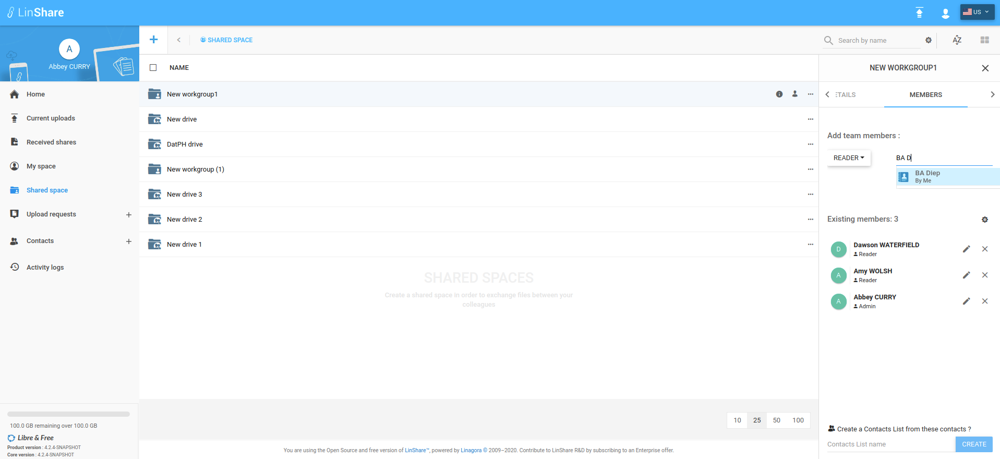

# Summary

* [Related EPIC](#related-epic)
* [Definition](#definition)
* [UI Design](#ui-design)
* [Misc](#misc)

## Related EPIC

* [New admin portal](./README.md)

## Definition

#### Preconditions

- Given that I am a LinShare user

#### Description

- After log-in LinShare successfully, I go to Shared space and see the list of Drives and Workgroups.
- I click on three-dot button and select option "Add a member", the left panel will be open with tab "Members" displaying
- On member tab, When I start to type in fields "Add recipients", there wil be a list of suggestion that matched
- This list can include internal users, guests, and contact lists 
- Contact list can be my own contact lists public contact lists by other users 
- I select a contact list from the suggestion list, then system will validate and add contact one by one in that list: 
   - If the contact on the list are internal users/guests, it will be added to the Workgroup/Drive with the selected roles 
   - If the contact is an external email, the system will display a toast message to inform that " [external email] cannot be added to the workgroup/drive
#### Postconditions

- When my contact lists are displayed in suggestion list, I can see the name of contact list and a label "By me" below
- When another user' contact lists are displayed in suggestion list, it will show the contact list's name and name of that contact lists' owner.
- When a user in contact list is added to a drive, it is also added to all workgroups inside that Drive.
- When a user in contact list is already a member of workgroup or drive, there will be a toast message :" [user name]is already a member of this Workgroup/Drive".
- When a user in contact list is already a member in a nested workgroup but not a member to the parent Drive, he is added to other nested workgroups with default workgroup role, except the nested workgroup that he is already a member. His role in this workgroup will remain the same as before.

[Back to Summary](#summary)

## UI Design

#### Mockups

#### Final design

[Back to Summary](#summary)
## Misc

[Back to Summary](#summary)
