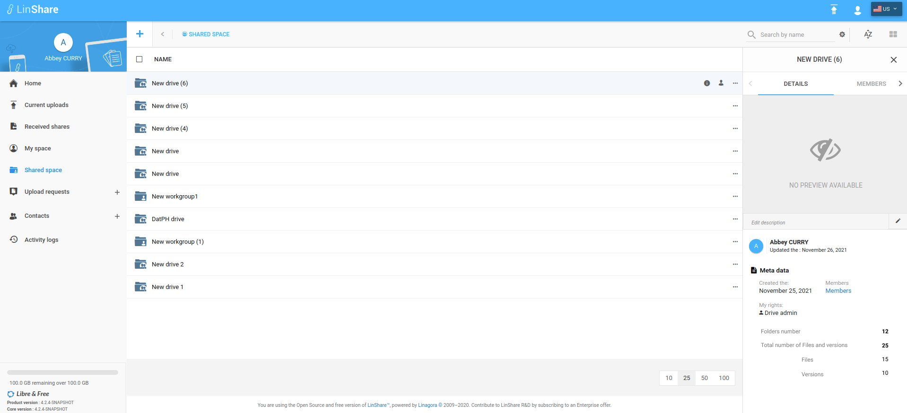

# Summary

* [Related EPIC](#related-epic)
* [Definition](#definition)
* [UI Design](#ui-design)
* [Misc](#misc)

## Related EPIC

* [New admin portal](./README.md)

## Definition

#### Preconditions

- Given that I am a LinShare user
- Given that Shared Space is enabled in my domain

#### Description

- After log-in LinShare successfully, I go to Shared space and see the list of Drives and Standalone Workgroups.
- For standalone workgroup, When I select option Details, The details panel will be opened
- I can click on one Drive and see the list of nested workgroups of that drive. I select option Details of a nested workgroup, the detail panel is opened.
- On the details panel, I can see some new information:
   - Folders number: none-editable number field 
   - Total number of Files and Versions: none-editable number field and be calculated as total of number of files and number of version below.
   - Files: none-editable number field
   - Versions: none-editable number field

#### Postconditions

- The number of folders is the sum of all folders inside that selected workgroup in every folder level.
- The number of files is the sum of all files in every folder level.
- The number of versions is the sum of all versions of all files in every folder level. 
[Back to Summary](#summary)

## UI Design

#### Mockups

#### Final design

[Back to Summary](#summary)
## Misc

[Back to Summary](#summary)
