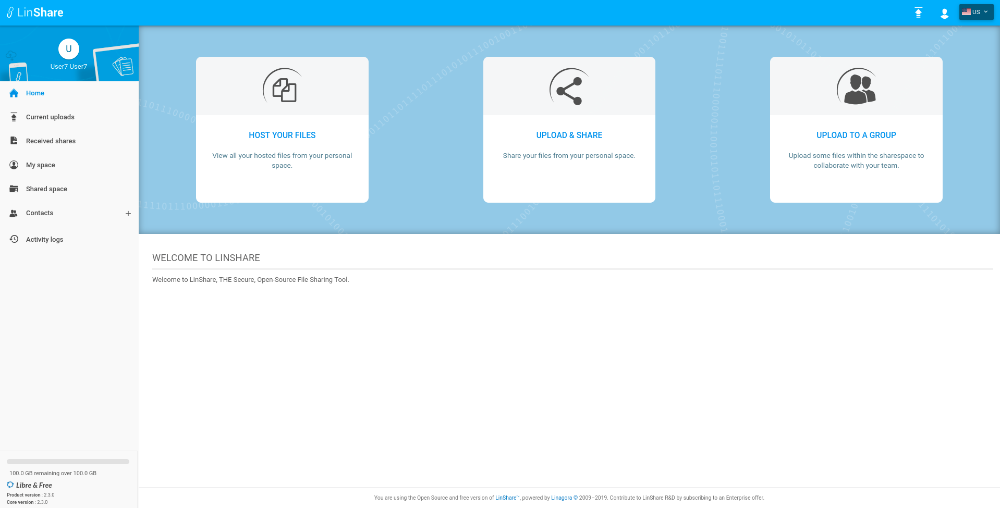
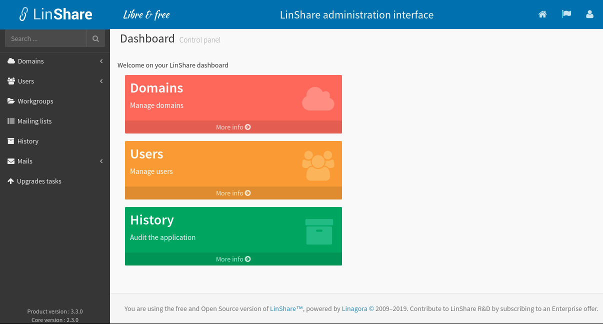

# LinShare Installation on CentOS

   * [LinShare Download](#dlLinshare)
   * [Archive and files configuration Deployment](#installFile)
   * [OpenJDK Java JRE Installation](#instalOpenJDK)
   * [Databases Installation](#bdd)
     * [PostgreSQL Installation](#postgre)
     * [MongoDB Installation](#mongo)
   * [Thumbnail Engine (optional)](#thumbnail)
   * [Tomcat Installation](#tomcat)
   * [Web Server Installation](#apache)
     * [ui-user vhost Configuration](#ui-user)
     * [ui-admin vhost Configuration](#ui-admin)
   * [Firewall Configuration](#firewalld)
   * [LinShare Configuration and Launching](#linconf)
   * [First Access](#firstAccess)

> Note :<br/>
This page provides a __LinShare__ version 2.3 installation on CentOS 7 (older CentOS versions are not supported).
Installation of previous versions of __LinShare__ are available at github branches in this case [LinShare 1.12.x](../../../../maintenance-1.12.x/documentation/EN/installation/linshare-install-centos.md)

## <a name="dlLinshare">LinShare Download</a>

__LinShare__  can be downloaded here :

[http://download.linshare.org/versions/](http://download.linshare.org/versions/)

> Note:<br/>
There are several versions of __LinShare__. Choose the version of __LinShare__ that is in agreement with the installation guide.
Do not install and use a component version which is different from the ones you'll find within the folder itself. Otherwise you will meet dependencies problems.

For this installation, download the following files :
  * linshare-core-{VERSION}.war
  * linshare-core-{VERSION}-sql.tar.bz2
  * linshare-ui-admin-{VERSION}.tar.bz2
  * linshare-ui-user-{VERSION}.tar.bz2

> Note :<br/>
In this process, it is considered that the files are downloaded in the `/tmp/linshare_data` temporary directory. Of course, it is possible to use another temporary directory.

To manipulate the archives, it is necessary to install `unzip` and `bzip2`:
```bash
yum install -y unzip bzip2
```

## <a name="installFile">Archive and files configuration Deployment</a>

Create the configuration repository of __LinShare__, past the configuration files, and rename the sample file as follow :
```bash
mkdir -p /etc/linshare
mv /tmp/linshare_data/linshare-core-{VERSION}.war /etc/linshare/linshare.war
unzip -j -d /etc/linshare/ linshare.war WEB-INF/classes/{linshare,log4j}.*
Archive:  linshare.war
  inflating: /etc/linshare/linshare.properties.sample  
  inflating: /etc/linshare/log4j.properties
mv /etc/linshare/linshare.properties.sample /etc/linshare/linshare.properties
```

Edit the file `/etc/linshare/log4j.properties` in order to replace the following line :
```java
log4j.rootCategory=INFO, CONSOLE
```
by the following one :
```java
log4j.rootCategory=INFO, LINSHARE
```
Check the following log file location
```java
log4j.appender.LINSHARE.File=/var/log/tomcat/linshare.log
```

## <a name="installOpenJDK">OpenJDK Java JRE Installation</a>

__LinShare__  works with OpenJDK or Sun/Oracle Java 8. Install it and activate it from the repositories :

```bash
yum -y install java-1.8.0-openjdk.x86_64
update-alternatives --config java
```

> Note :<br/>
You can ignore the possible errors from the Java plugin.

## <a name="bdd">Databases Installation</a>

> Note :<br />
At the beginning, LinShare was developped with PostgreSQL. New functionalities have been developped with MongoDB. Roadmap is to move everything to MongoDB. Task is huge, so LinShare is actually using both databases.

### <a name="postgre">PostgreSQL Installation</a>

__Linshare__ requires the use of PostgreSQL for its files and configuration. This section gives details about the PostgreSQL installation.

> Note :<br/>
MySQL database is not compatible anymore since LinShare v2.

```bash
yum install -y postgresql postgresql-server
```

Configurer and start the PostgreSQL service :
```bash
postgresql-setup initdb
systemctl enable postgresql
systemctl start postgresql
```

Adapt the PostgreSQL access file in `/var/lib/pgsql/data/pg_hba.conf`:
```bash
 # TYPE  DATABASE                  USER          CIDR-ADDRESS         METHOD
 local   all               postgres               peer
 local   linshare                  linshare                           md5
 host    linshare                  linshare      127.0.0.1/32         md5
 host    linshare                  linshare      ::1/128              md5
```

> Note :<br/>
These lines are usually at the end of the file.
For security reasons, the postgreSQL service only listens in local.

Restart PostgreSQL service:
```bash
systemctl restart postgresql
```

You should also add those rules among the first. Indeed, PostgreSQL uses the first valid rule which match the authentication request.

Create the user linshare (password is PASSWORD") :
```bash
su - postgres
[postgres@localhost ~]$ psql
CREATE ROLE linshare
  ENCRYPTED PASSWORD 'PASSWORD'
  NOSUPERUSER NOCREATEDB NOCREATEROLE INHERIT LOGIN;
\q
```

Commands: to quit, type `\q`, to get help, type `\?`.

Create and import the database schemas :
```bash
su - postgres
[postgres@localhost ~]$ psql
CREATE DATABASE linshare
  WITH OWNER = linshare
       ENCODING = 'UTF8'
       TABLESPACE = pg_default
       LC_COLLATE = 'en_US.UTF-8'
       LC_CTYPE = 'en_US.UTF-8'
       CONNECTION LIMIT = -1;
GRANT ALL ON DATABASE linshare TO linshare;
\q
```

> Note :<br/>
Eventually use the script named `createDatabase.sh` from `src/main/resources/sql/postgresql/` which provides the commands to create the database.

Import the SQL files `createSchema.sql` and `import-postgresql.sql`:
```bash
cd /tmp/linshare_data
tar xjvf linshare-core-*-sql.tar.bz2
psql -U linshare -W -d linshare -f linshare-core-sql/postgresql/createSchema.sql
Password for user linshare: PASSWORD
psql -U linshare -W -d linshare -f linshare-core-sql/postgresql/import-postgresql.sql
Password for user linshare: PASSWORD
```

Edit the __LinShare__ configuration file in `/etc/linshare/linshare.properties`:
```java
#******************** DATABASE
### PostgreSQL
linshare.db.username=linshare
linshare.db.password=PASSWORD
linshare.db.driver.class=org.postgresql.Driver
linshare.db.url=jdbc:postgresql://localhost:5432/linshare
linshare.db.dialect=org.hibernate.dialect.PostgreSQLDialect
```

### <a name="mongo">MongoDB Installation</a>

For the __LinShare__ installation, it is required to install a MongoDB database.
MongoDB package does not exist within the default repositories for CentOS. However, MongoDB maintains a dedicated repository. Let's add it:

Create a file `/etc/yum.repos.d/mongodb-org.repo`, and add the repository informations in the latest stable release  to the file:
```bash
[mongodb-org-3.2]
name=MongoDB Repository
baseurl=https://repo.mongodb.org/yum/redhat/$releasever/mongodb-org/3.2/x86_64/
gpgcheck=1
enabled=1
gpgkey=https://www.mongodb.org/static/pgp/server-3.2.asc
```

Install the mongodb-org package from the new repository, by using the yum utility:
```bash
yum install -y mongodb-org
```

By default, MongoDB is configured with the following __LinShare__ configuration in the file `/etc/linshare/linshare.properties` :

```java
#### Mongo storage options ####
linshare.mongo.connect.timeout=30000
linshare.mongo.socket.timeout=30000

#### Write concern
# MAJORITY: waits on a majority of servers for the write operation.
# JOURNALED: Write operations wait for the server to group commit to the journal file on disk.
# ACKNOWLEDGED: Write operations that use this write concern will wait for acknowledgement,
#                               using the default write concern configured on the server.
linshare.mongo.write.concern=MAJORITY

# Standard URI connection scheme
linshare.mongo.client.uri=mongodb://127.0.0.1:27017/linshare
```

Before starting the MongoDB service, check that the file `/etc/mongod.conf` has the bind ip address: 127.0.0.1.
Then, configure and start the MongoDB service:

```bash
systemctl enable mongod
systemctl start mongod
```

## <a name="thumbnail">Thumbnail Engine (optional)</a>

> Note :<br/>
There is a bug in the library that is used by __LinShare__ in order to communicate with LibreOffice (specific to CentOS). LinShare developpment team is actually working on this issue (08/2019).

__LinShare__ has a preview generation engine for a wide range of files :
 - OpenDocument format (ODT, ODP, ODS, ODG)
 - Microsoft documents format (DOCX, DOC, PPTX, PPT, XLSX, XLS)
 - PDF documents
 - Images files (PNG, JPEG, JPG, GIF)
 - Text files (TXT, XML, LOG, HTML ...)

> Note :<br/>
Before using this engine you should have LibreOffice installed on your machine, the minimum version of libreOffice is : 4.2.8.

To install libreOffice:
```bash
yum -y install libreOffice
```

By default thumbnail generation engine is set to `FALSE`. To enable it, edit __LinShare__ configuration file in `/etc/linshare/linshare.properties`:

```java
#******** LinThumbnail configuration
# key to enable or disable thumbnail generation
linshare.documents.thumbnail.enable=true
linshare.linthumbnail.dropwizard.server=http://0.0.0.0:8090/linthumbnail?mimeType=%1$s
linshare.documents.thumbnail.pdf.enable=true
```
This will allow to generate previews after each file upload.

To use it, download the following files from [http://download.linshare.org/versions/](http://download.linshare.org/versions/) :
* linshare-thumbnail-server-{VERSION}.jar
* linshare-thumbnail-server-{VERSION}.yml

> Note :<br/>
In this process, it is considered that the files are downloaded in the `/tmp/linshare_data` temporary directory. Of course, it is possible to use another temporary directory.

> Note <br>
By default the server is configured to listens on port 80, it is possible to change it.

Install the file `linshare-thumbnail-server-{VERSION}.yml` into `/etc/linshare/linshare-thumbnail-server.yml` and install the java archive `linshare-thumbnail-server-{VERSION}.jar` into the repository `/usr/local/sbin/linshare-thumbnail-server.jar` :
```java
mv /tmp/linshare_data/linshare-thumbnail-server-*.yml /etc/linshare/linshare-thumbnail-server.yml
mv /tmp/linshare_data/linshare-thumbnail-server-*.jar /usr/local/sbin/linshare-thumbnail-server.jar
```

Creating a systemd service can be useful to automcatically start the thumbnail engine in background at system boot. Create the file `/etc/systemd/system/linshare-thumbnail-server.service`, and add the following content :

```bash
[Unit]
Description=LinShare thumbnail server
After=network.target

[Service]
Type=idle
KillMode=process
ExecStart=/usr/bin/java -jar /usr/local/sbin/linshare-thumbnail-server.jar server /etc/linshare/linshare-thumbnail-server.yml

[Install]
WantedBy=multi-user.target
Alias=linshare-thumbnail-server.service
```

Configure and start the new service :
```bash
systemctl daemon-reload
systemctl enable linshare-thumbnail-server.service
systemctl start linshare-thumbnail-server.service
```

## <a name="tomcat">Tomcat Installation</a>

__LinShare__ is a Java application compiled and embedded under the WAR (**W** eb **A** pplication a **R** chive) format, so it needs a servlet container Java (Tomcat or Jetty) to run. This section describes its installation and configuration.

Install Tomcat from the repositories:
```bash
yum install -y tomcat
```

To specify the location of the __LinShare__ configuration (_linshare.properties_ file) and also the default start
options, get the commented lines in the header of the `linshare.properties` file and copy-paste them in the tomcat file (`/etc/sysconfig/tomcat`):

All starting needful options by default to Linshare are indicated in the header of the following configuration files :
  * `/etc/linshare/linshare.properties`
  * `/etc/linshare/log4j.properties`

It is required to add the following lines in: `/etc/sysconfig/tomcat`:

```conf
JAVA_OPTS="-Djava.awt.headless=true -Xms512m -Xmx2048m -Dlinshare.config.path=file:/etc/linshare/ -Dlog4j.configuration=file:/etc/linshare/log4j.properties"
```
If you want to change the location of tmp directory concatenate line below to `JAVA_OPTS`:
```conf
JAVA_OPTS="... -Djava.io.tmpdir=/tmp/"
```
####profiles
LinShare provides different profiles that can allow you to conditionally constrcut the application (different way of storage, authentication ...), availables profiles are listed above.
To configure which profile you want to use.
You can edit used profiles by adding the following key to the JAVA_OPTS parameter.
Example with the default value:

```config
JAVA_OPTS=" ... -Dspring.profiles.active=default,jcloud,batches"
```
> **NB** You must enable at least one authentication profile among authentication profiles

Available authentication profiles :
* default : default authentication process.
* sso : Enable headers injection for SSO.

Available file data store profiles :
* jcloud : Using jcloud as file data store : Amazon S3, Swift, Ceph, filesystem.
* gridfs : Using gridfs (mongodb) as file data store.
Recommended profile for production is jcloud with Swift.

Additional profiles :
* batches : if this profile is enabled (by default it should be), it will enable all Quartz jobs (cron tasks).

Ex: If you want to use `gridfs`: "-Dspring.profiles.active=default,gridfs,batches"

In the tomcat file `/usr/share/tomcat/conf/catalina.properties`, return carriage are marked with the `\` character, in order to reduce the lines width of the values for each configuration key. There is a key named `tomcat.util.scan.DefaultJarScanner.jarsToSkip`. Add `jclouds-bouncycastle-1.9.2.jar,bcprov-*.jar,\` somewhere in the section of this key.
Here is an extract of the file `/usr/share/tomcat/conf/catalina.properties` with the added line in the middle:
```java
jetty-*.jar,oro-*.jar,servlet-api-*.jar,tagsoup-*.jar,xmlParserAPIs-*.jar,\
jclouds-bouncycastle-1.9.2.jar,bcprov-*.jar,\
xom-*.jar
```

Deploy the __LinShare__ application archive into the Tomcat server:
```bash
mv /etc/linshare/linshare.war /usr/share/tomcat/webapps/linshare.war
```

## <a name="apache">Web Server Installation</a>

__LinShare__ administration interface is exploiting web languages such as HTML/CSS and JavaScript. It requires a simple web server such as Apache or Nginx. This section presents the Apache HTTP server installation.

Install httpd from the repositories :
```bash
yum install -y httpd
```

### <a name="ui-user">ui-user vhost Configuration</a>

To deploy the __LinShare__ application, it is necessary to activate the __mod_proxy__ module on httpd.

Create the subdirectories in the directory `/var/www/`, note that the repository name will be the application domain name. Assign to the user the access permissions to the subdirectories.

```bash
mv /tmp/linshare_data/linshare-ui-user-<VERSION>.tar.bz2 /var/www/
cd /var/www/
tar xjf linshare-ui-user-<VERSION>.tar.bz2
chown -R apache: linshare-ui-user
rm -fr /var/www/linshare-ui-user-<VERSION>.tar.bz2
```

To deploy the __LinShare__ application, it is necessary to create the virtualhost configuration file. Add the file `/etc/httpd/conf.d/linshare-ui-user.conf` with the following content:

```xml
<VirtualHost *:80>
...
ServerName linshare-user.local
DocumentRoot /var/www/linshare-ui-user
<Location /linshare>
    ProxyPass http://127.0.0.1:8080/linshare
    ProxyPassReverse http://127.0.0.1:8080/linshare
    ProxyPassReverseCookiePath /linshare /

    # Workaround to remove httpOnly flag (could also be done with Tomcat)
    Header edit Set-Cookie "(JSESSIONID=.*); Path.*" "$1; Path=/"
    # For https, you should add Secure flag.
    # Header edit Set-Cookie "(JSESSIONID=.*); Path.*" "$1; Path=/; Secure"

    #This header is added to avoid the JSON cache issue on IE.
    Header set Cache-Control "max-age=0,no-cache,no-store"
</Location>

ErrorLog /var/log/httpd/linshare-user-error.log
CustomLog /var/log/httpd/linshare-user-access.log combined
...
</Virtualhost>
```

> Note:<br/>
   * After any modification of a vhost, you must reload the Apache server :<br/>
   `[root@localhost ~]$ sudo systemctl restart httpd.service` <br/>

### <a name="ui-admin">ui-admin vhost Configuration</a>

Deploy the archive of the application __LinShare__ UI Admin in the httpd repository :
```bash
mv /tmp/linshare_data/linshare-ui-admin-{VERSION}.tar.bz2 /var/www
cd /var/www/
tar xjf linshare-ui-admin-{VERSION}.tar.bz2
chown -R apache: linshare-ui-admin
rm -fr /var/www/linshare-ui-admin-<VERSION>.tar.bz2
```

To deploy the __LinShare__ administration interface, it is necessary to create the virtualhost configuration file. Add the file `/etc/httpd/conf.d/linshare-ui-admin.conf` with the following content:

```xml
<VirtualHost *:80>
...
ServerName linshare-admin.local
DocumentRoot /var/www/linshare-ui-admin
<Location /linshare>
    ProxyPass http://127.0.0.1:8080/linshare
    ProxyPassReverse http://127.0.0.1:8080/linshare
    ProxyPassReverseCookiePath /linshare /

    # Workaround to remove httpOnly flag (could also be done with Tomcat)
    Header edit Set-Cookie "(JSESSIONID=.*); Path.*" "$1; Path=/"
    # For https, you should add Secure flag.
    # Header edit Set-Cookie "(JSESSIONID=.*); Path.*" "$1; Path=/; Secure"

    #This header is added to avoid the  JSON cache issue on IE.
    Header set Cache-Control "max-age=0,no-cache,no-store"
</Location>

ErrorLog /var/log/httpd/linshare-admin-error.log
CustomLog /var/log/httpd/linshare-admin-access.log combined
...
</Virtualhost>
```

> Note:<br/>
  * After any modification of a vhost, you must reload the Apache server :<br/>
   `[root@localhost ~]$ sudo systemctl restart httpd.service` <br/>

> Note :<br/>
You have some vhost's examples in the following repository : [utils/apache2/vhosts-sample/](../../../utils/apache2/vhosts-sample/)

Configure and start the httpd service:
```bash
systemctl enable httpd
systemctl start httpd
```

## <a name="firewalld">Firewall Configuration</a>

When needed, add the 80 port and eventually all necessary ports into the `/etc/firewalld/zones/public.xml` file:
```xml
<?xml version="1.0" encoding="utf-8"?>
<zone>
  <short>Public</short>
  ...
  <port protocol="tcp" port="80"/>
</zone>
```

Then, restart the service, so that all changes are taken into account:
```bash
systemctl restart firewalld
```

## <a name="linconf">LinShare Configuration and Launching</a>

Configure the storage location of the files in the __LinShare__ configuration file `/etc/linshare/linshare.properties` :
```java
linshare.documents.storage.filesystem.directory=/var/lib/linshare/filesystemstorage
linshare.encipherment.tmp.dir=/var/lib/linshare/tmp
```

In this configuration, it is necessary to create the folder with the correct permissions:
```bash
mkdir -p /var/lib/linshare
chown -R tomcat:tomcat /var/lib/linshare
```

Configure the SMTP service access so that __LinShare__ can send message notifications in the __LinShare__ configuration `/etc/linshare/linshare.properties` file:
```java
mail.smtp.host=<smtp.yourdomain.com>
mail.smtp.port=25
mail.smtp.user=linshare
mail.smtp.password=<SMTP-PASSWORD>
mail.smtp.auth.needed=false
mail.smtp.charset=UTF-8
```

On __LinShare__, there are two possible authentication modes, the first is the nominal mode, and the second is the SSO mode. To start LinShare you must at least enable one of those two following modes:
* default : default authentication process.
* sso : nable headers injection for SSO. This profile includes default profile capabilities

The default profile is jcloud with filesystem for tests purpose.

You can override this parameter by using `-Dspring.profiles.active=xxx`
Or you can use the environment variable : `SPRING_PROFILES_ACTIVE`.

You must enable at least one authentication profile:
* jcloud : Using jcloud as file data store : Amazon S3, Swift, Ceph, filesystem (test only).
* gridfs : Using gridfs (mongodb) as file data store.

> Note :<br/>
Recommended profile for production is jcloud with Swift.

Configure and start the tomcat service, in order to start the __LinShare__ application:
```bash
systemctl enable tomcat
systemctl start tomcat
```

To check that __LinShare__ is working, check the logs:
```bash
tail -f /var/log/tomcat/catalina.out
```

Once the service has successfully started, the following message may appear:
```
org.apache.coyote.http11.Http11Protocol start
INFO: Démarrage de Coyote HTTP/1.1 sur http-8080
org.apache.catalina.startup.Catalina start
INFO: Server startup in 23151 ms
```

Then restart the Apache service :

`[root@localhost ~]$ sudo systemctl restart httpd.service`

### <a name="firstAccess">First Access</a>

> Note: <br>
Before the first access to __LinShare__ you need to add `linshare-user.local` and `linshare-admin.local` to `/etc/hosts`

__LinShare__ service is now reachable at the following adresses:

For the user interface:
  * http://linshare-user.local/linshare



For the administration interface:
  * http://linshare-admin.local/

Here are the default credentials for the system administrator:
  * Username : root@localhost.localdomain
  * Password : adminlinshare

Please change the password in the administration interface.

> Note :<br/>
It is not possible to add other LinShare standard users locally without LDAP. Please see the dedicated page for the LDAP configuration in the [application parameters](../administration/linshare-admin.md).


