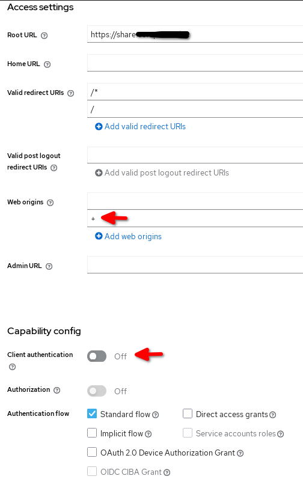

# Integration with Keycloak

Keycloak is an open source Web Single Sign On (WebSSO) supporting multiple
protocoles, like OIDC and SAML. In this case, we are going to use OIDC.  


## Resume


Deployment of Keycloak is out of scope of this document, you can find a
lot of documentation about Keycloak installation here: https://www.keycloak.org/guides#getting-started.
We assume you already have a running instance of Keycloak and LinShare.

For the whole guide, I will assume you are using my favorite Linux distribution, aka Debian.

According to our installation guide, LinShare is deployed on http://linshare-user.local.


/!\ there is two ways to use OIDC:
  * You can only delegate the authentication to OIDC but for the provisioning
    you will still rely on user providers (LDAP or TWAKE) to create/provision
    users.
  * You can also decide to delegate the provisioning to OIDC (full delegation).
    To do that, you need to use the OIDC user provider. Users will be created at
    first connection or when they are added to a sharing or a worgroups. User's
    profile will be created using OIDC claims as source of information. See Step 4.


## Step 1: Keycloak configuration.

You need to add a new `Client Scope` and a new `Client`.

### Client scope

Go to `Client Scopes`, click `Create client scope`
- `Name`: `linshare`
- `Description`: `Linshare claims`

Go to the TAB `Mappers`
- Click `Add mapper`, `By configuration`
- From the list choose `User Property`
- `Name`: `first_name`
- `Property`: `firstName`
- Click `Save`

- Click `Add mapper`, `By configuration`
- From the list choose `User Property`
- `Name`: `last_name`
- `Property`: `lastName`
- Click `Save`

### Client

Go to `Client`, click `Create client`
- `Name`: `linshare`
- `Description`: `Linshare`
- `Root URL`: url of linshare
- `Valid redirect URIs`: `/*` and `/`
- `Web origins`: `+`
- `Client authentication`: `Off`



Go to the TAB `Client scopes`

- Click `Add client scope`
- Select `email` and `linshare` 
- Click `Add`

Check the claims for the client

- Click on `Evaluate`
- `Users`: select a user
- Click on `Generated access token`
- Check the content of the token

Go to the TAB `Settings`
- Click `Save`

Since we have put the `Root URL` for the Ui-user in the client, create another client for Ui-admin with its `Root URL`.


## Step 2: LinShare backend configuration

### Enable OIDC support in LinShare.


You need to edit `/etc/linshare/linshare.properties` and add/uncomment the following keys:

```
## OIDC Parameters
oidc.on=true
oidc.issuerUri=http://auth.linshare.local
oidc.client.id=linshare
oidc.client.secret=linshare
# oidc.access.claim.value=true
```


### Restart
Finally just restart Tomcat : `systemctl restart tomcat`.


## Step 3: LinShare frontend configuration

## Step 3.1: LinShare frontend configuration : Ui-User

You need to edit the configuration file linshare-ui-user/config/config.js
and add the following keys:

```
    ...
    homePage: 'home',
    ...
    oidcSetting: {
      authority: 'http://auth.linshare.local',
      oidcToken: 'Oidc-Jwt',
      client_id: 'linshare',
      client_secret: 'linshare',
      scope: 'openid email linshare',
      loadUserInfo: false
    },
    oidcEnabled: true,
    oidcForceRedirection: false,
```

## Step 3.2: LinShare frontend configuration : Ui-Admin

You need to edit the configuration file linshare-ui-admin/new/config/config.js
and add the following keys:

```
    ...
    homePage: 'home',
    ...
    oidcSetting: {
      authority: 'http://auth.linshare.local',
      oidcToken: 'Oidc-Jwt',
      client_id: 'linshare',
      client_secret: 'linshare',
      scope: 'openid email linshare',
    },
    oidcEnabled: true,
```

## Step 4: Optional OIDC claims

Above description configures just the minimum set of claims, however there are number of optional claims.

Optional claims can be added to client scope `linshare.` in Keycloak.

### Domain discriminator

Allows LinShare to create users for a domain when an user authenticates with OIDC. 
The user will be created if a value in the claim `domain_discriminator` matches with the value in the Ui-admin

- Name: `domain_discriminator`
- Type: list of strings, e.g. `["domain-1"]`

Linshare configuration:
 
- In Ui-admin goto: `Configuration`, `Select domain`, select a domain, `Providers`, `User providers`, put one of stings in `Associated domain identifier`

### External uid

The value will store its value in the user profile upon first connection. 
In successive OIDC authentication attempts the store value will be compared with the claim value in order to be sure it is the same user.

- Name: `external_uid`
- Type: string

Linshare configuration:
 
- In Ui-admin goto: `Configuration`, `Select domain`, select a domain, `Providers`, `User providers`, tag `Check external user identifier`

### Linshare access

Determines whether the user is permitted to login in Linshare.

- Name: `linshare_access`
- Type: boolean

Linshare configuration:
 
- In `/etc/linshare/linshare.properties` add `oidc.access.claim.value=true`
- In Ui-admin goto: `Configuration`, `Select domain`, select a domain, `Providers`, `User providers`, tag `Use access claim`

### Linshare role

The value will be used as default role value when creating the profile at first connection.

- Name: `linshare_role`
- Type: string, one of existing locales: `ADMIN`, `SIMPLE`

Linshare configuration:
 
- In Ui-admin goto: `Configuration`, `Select domain`, select a domain, `Providers`, `User providers`, tag `Use role claim`


### Linshare locale

The value will be used as default locale value when creating the user profile at first connection.

- Name: `linshare_locale`
- Type: string, one of existing locales: `ENGLISH`, `FRENCH`, `RUSSIAN`

Linshare configuration:
 
- In Ui-admin goto: `Configuration`, `Select domain`, select a domain, `Providers`, `User providers`, tag `Use email locale claim`
