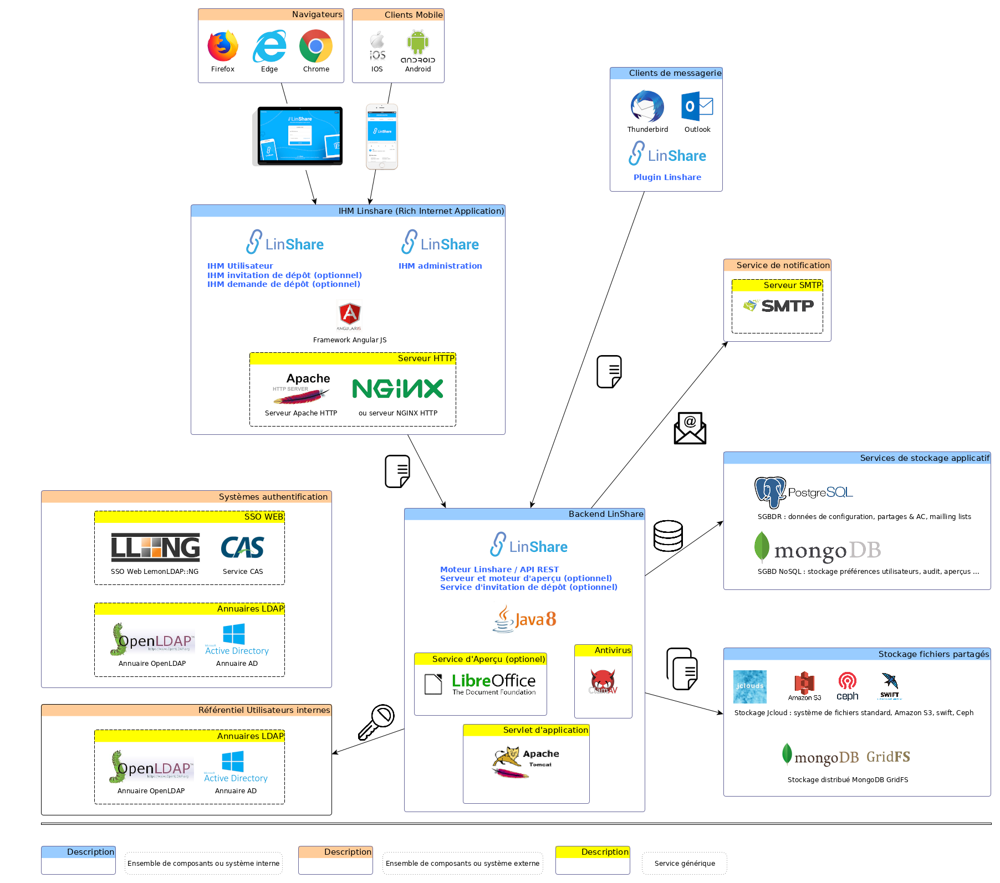
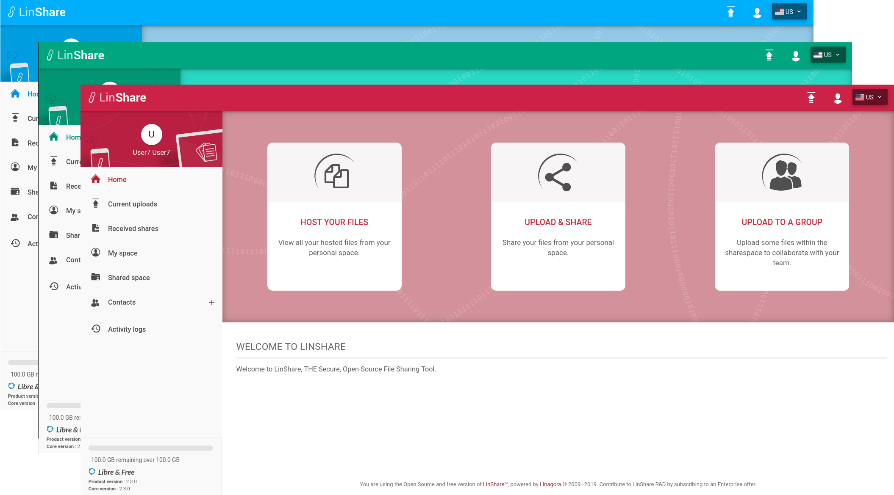

# Exploitation et Administration

   * [Architecture & Plateforme](#aap)
       * [Recommandations Système](#sr)
       * [Architecture Globale](#ga)
       * [Composants, Services et Logs](#csal)
       * [Flux réseau](#na)
   * [Configuration système](#sc)
       * [Paramétrage système](#ss)
           * [Java](#ssj)
           * [PostgreSQL](#sssgbd1)
           * [MongoDB](#sssgbd2)
           * [Servlet d'application Tomcat](#sst)
           * [Serveur Web : apache ou nginx](#ssws)
           * [Parefeu](#fw)
       * [Paramétrage applicatif](#as)
           * [Délai de session](#sd)
           * [Thème du front-office LinShare](#ls)
           * [Propriétés Java : fichier properties](#jpf)
           * [Propriétés de l'utilitaire de journalisation (logging) : log4j (seulement CentOS)](#jl4jpf)
   * [Gestion & Exploitation](#mae)
       * [Mode Maintenance](#mm)
       * [Services & Composants](#sac)
           * [Démarrer, vérifier le status & arrêter un service](#scss)
           * [Services & Utilisation des fichiers](#fuas)
       * [Requêtes & Statistiques](#qas)
           * [Statistiques de la plateforme](#ps)
           * [Statistiques Utilisateur](#us)
   * [Mises à jour applicatives](#au)

## <a name="aap">Architecture & Plateforme</a>

### <a name="sr">Recommandations Système</a>

>Note :<br/>
Le suffixe de version `+` précise une compatibilité avec n'importe quelle version supérieure. Sinon, seule la compatibilité de la version précisée est garantie.

| Description | Valeur |
| ---------- | ------- |
| Architecture | x64/x86 |
| Processeur | ? |
| Mémoire Vive | ? |
| Espace Disque | 1 Go pour l'application + autant d'espace nécessaire pour les fichiers |
| Système d'Exploitation | Linux CentOS 7+ ou Debian 8+ |
| Noyau | 3.10+ (CentOS) |

#### Dépendances :

| Dépendance | Version |
| ---------- | ------- |
| Java (openjdk) | 8 (linshare 2.0 to 2.3) or 11 (from linshare 2.4) |
| PostgreSQL | 9.2.24+ |
| MongoDB | 3.2.22+ |
| apache | 2.4.6+ |
| tomcat | 7 (CentOS) / tomcat 8 (Debian) |
| libreoffice | 6.2 |

### <a name="ga">Architecture Globale</a>



### <a name="csal">Composants, Services et Logs</a>

L'application LinShare est composée de plusieurs composants; chaque composant étant lié à un service. Savoir gérer ces services et consulter les logs respectifs aide à diagnostiquer rapidement les problèmes.

Ce tableau est un récapitulatif de tous les services utilisés par l'application LinShare.

| Composant | Service | Fichier de configuration | Fichier de logs |
| --------- | ------- | ------------------------ | --------------- |
| Conteneur de servlets | tomcat8 (Debian) | /var/lib/tomcat8/conf/catalina.properties | /var/log/tomcat8/catalina.out |
| | tomcat (CentOS) | /etc/httpd/conf.d/ | /var/log/tomcat/catalina.out |
| Serveur Web | apache2 (Debian) | /etc/apache2/sites-available/ | /var/log/apache2/linshare* |
| | httpd (CentOS) | /usr/share/tomcat/conf/catalina.properties | /var/log/httpd/linshare* |
| PostgreSQL | postgresql | /var/lib/pgsql/data/pg_hba.conf | /var/lib/pgsql/data/pg_log/ |
| MongoDB | mongod | /etc/mongod.conf | /var/log/mongodb/mongod.log |
| Moteur d'aperçu | linshare-thumbnail-server | /etc/linshare/linshare-thumbnail-server.yml | /var/log/thumbnail-server.log |

>Note :<br/>
Voir la section dédiée à l'[exploitation des Services & Composants](#sac) pour la gestion des services.

### <a name="na">Flux réseaux</a>

| Port | Transport | Service/Composant | Protocole | Description |
| ---- | --------- | ----------------- | --------- | ----------- |
| 25 | tcp | postfix | SMTP | Serveur de mail sortant |
| 636 | tcp | slapd | LDAPS | Service d'annuaire |
| 443 | tcp | httpd ou apache2 / nginx | HTTPS | Interface client (navigateur web ou extension client messagerie) avec le font-end de LinShare |
| 8080 | tcp | tomcat8 ou tomcat | HTTP | Interface front-end avec back-end de LinShare |
| 8005 | tcp | tomcat8 ou tomcat | AJP | `Shutdown` Tomcat |
| 8009 | tcp | tomcat8 ou tomcat | AJP | Interface de management interne Tomcat pour gérer les servlets d'application |
| 443 / 6800->7300 / 500 | tcp | jCloud Storage | HTTPS | Stockage Amazon S3 / ceph / swift (optionel) |
| 5432 | tcp | postgresql | PostgreSQL Wire Protocol | Socket de connexion PostgreSQL |
| 27017 | tcp | mongod | MongoDB Wire Protocol | Socket de connexion MongoDB |
| 8090 | udp | linshare-thumbnail-server | ? | Socket libreoffice pour afficher les aperçus de fichiers (optionel) |


## <a name="sc">Configuration système</a>

### <a name="ss">Paramétrage système</a>

#### <a name="ssj">Java</a>

Voir la page d'installation dédiée à cette configuration : [CentOS](../installation/linshare-install-centos.md#installation-de-openjdk-java-jre) ou [Debian](../installation/linshare-install-debian.md#installation-de-openjdk-java-jre).

#### <a name="sssgbd1">PostgreSQL</a>

Voir la page d'installation dédiée à cette configuration : [CentOS](../installation/linshare-install-centos.md#installation-de-postgresql) ou [Debian](../installation/linshare-install-debian.md#installation-de-postgresql).

#### <a name="sssgbd2">MongoDB</a>

Voir la page d'installation dédiée à cette configuration : [CentOS](../installation/linshare-install-centos.md#installation-de-mongodb) ou [Debian](../installation/linshare-install-debian.md#installation-de-mongodb).

#### <a name="sst">Servlet d'application Tomcat</a>

Voir la page d'installation dédiée à cette configuration : [CentOS](../installation/linshare-install-centos.md#installation-de-tomcat) ou [Debian](../installation/linshare-install-debian.md#installation-de-tomcat).

#### <a name="ssws">Serveur Web</a>

Voir la page d'installation dédiée à la configuration du serveur Apache : [CentOS](../installation/linshare-install-centos.md#installation-du-serveur-web) ou [Debian](../installation/linshare-install-debian.md#installation-du-serveur-web).

>Note:<br/>La configuration nginx n'est pas décrite dans cette documentation.

#### <a name="fw">Parefeu</a>

Voir la page d'installation dédiée à la configuration du parefeu `firewalld` : [CentOS](../installation/linshare-install-centos.md#firewalld).

### <a name="as">Paramétrage applicatif</a>

#### <a name="sd">Délai de session</a>

Cette configuration s'effectue dans le fichier fichier suivant:
* sur Debian : `/usr/local/tomcat/conf/web.xml`
* sur CentOS : `/etc/tomcat/web.xml`

Remplacer par la valeur souhaitée (temps en minutes!)
```xml
    <session-config>
        <session-timeout>1</session-timeout>
    </session-config>
```

Sauvegarder le fichier et redémarrer tomcat.
Sur Debian:
```bash
service tomcat8 reload
```
Sur CentOS:
```bash
systemctl reload tomcat
```

#### <a name="ls">Thème du front-office LinShare</a>

LinShare contient une liste de thèmes préchargés:
* default : thème bleu
* darkgreen
* red.



> Note:<br />
Il est aussi possible de créer son propre thème. Pour créer un thème, se référer à la page dédiée: [creating_a_theme_for_linshare](../development/linshare-ui-user/creating_a_theme_for_linshare.md) [`EN`].

Pour basculer entre les différents thèmes, il est nécessaire de définir une règle de redirection lors de l'appel du fichier thème css, au niveau du serveur web Apache ou nginx, seulement pour l'interface utilisateur.
Le fichier de configuration Apache à modifier se situe par défaut dans :
* `/etc/httpd/conf.d/linshare-ui-user.conf` sur CentOS
* `/etc/apache2/sites-available/linshare-ui-user.conf` sur Debian.

L'exemple ci-dessous montre la mise en place de cette redirection pour un serveur Apache, sur une configuration Apache standard, c'est-à-dire celle définie lors de l'installation (voir la page [CentOS](../installation/linshare-install-centos.md#configuration-vhost-ui-user) ou [Debian](../installation/linshare-install-debian.md#configuration-vhost-ui-user) correspondante).
Voici un exemple de configuration complète de configuration Apache du front-office, pour obtenir le thème `red` :

```xml
<VirtualHost *:80>
...
ServerName linshare-user.local
...
<Directory /var/www/linshare-ui-user/styles>
    RewriteEngine On
    RewriteRule "theme\.default\.(.*)\.css$" theme.red.$1.css
</Directory>
...
</Virtualhost>
```

> Attention:<br />
Ne jamais modifier manuellement la référence `stylesheet` dans le fichier `linshare-ui-user/index.html`. En effet, le suffixe du fichier css change à chaque nouvelle version de LinShare.

> Note:<br>
Pour l'image Docker, il existe une variable d'environnement pour surcharger le thème: `LINSHARE_THEME`. Cette variable peut prendre pour valeur: `default`, `darkgreen`, `red`, ou tout autre nom de thème installé.

##### Customisation avancée

Dans le fichier config/config.js, il est aussi possible de surcharger les images:
```js
// To override the application logo set the url of the image corresponding to the sizes (small 155x29 and big 500x192)
applicationLogo : {
      small : 'images/common/linshare-logo-white.png',
      large : 'images/ls-logo-big.png'
},

// To override the background image of the login screen set the url of the image
loginBackground : 'images/bg-linshare-desktop.png',

```

#### <a name="jpf">Propriétés Java : fichier properties</a>

> Attention :<br/>
Cette section concerne seulement CentOS, puisque Debian utilise `logrotate`.

Se référer à la [page dédiée à ce sujet](./configuration-administration.md).

#### <a name="jl4jpf">Propriétés de l'utilitaire de journalisation (logging) : log4j (seulement CentOS)</a>

LinShare exploite l'utilitaire de journalisation (logging) `log4j 2` **pour CentOS**. Sa configuration est dans le fichier `/etc/linshare/log4j.properties`.

##### Niveaux de Verbosité

L'utilitaire `log4j 2` présente plusieurs niveaux de verbosité de journalisation :

| Niveau | Description |
| ------ | ----------- |
| OFF | Pas de journalisation de l'application. |
| FATAL | Erreurs sévères qui cause un arrêt prématuré de l'application. |
| ERROR | Autres erreurs de temps d'exécution ou conditions innatendues. |
| WARN |  Utilisation dépréciée, mauvaise utilisation de l'API, ou autres situations indésirables ou innatendues qui ne sont pas nécessairement fausses. |
| INFO | Evènements d'exécutions remarquables (démarrage, arrêt). |
| DEBUG | Flux d'exécution détaillé. Tout ce qui est loggé par LinShare est visible avec ce niveau de verbosité.  |
| TRACE | Niveau de verbosité le plus détaillé (pas utilisé, équivalent à `DEBUG` pour LinShare). |

>Note:<br/>Par défaut, l'application est livrée avec `INFO` comme niveau. Il peut donc être nécessaire de basculer vers le niveau `DEBUG` pour obtenir plus de détails, notammment pour le déboggage.

Ce réglage est disponible par le biais du réglage `log4j.rootCategory` dans le fichier de configuration `/etc/linshare/log4j.properties` :

```java
log4j.rootCategory=INFO, LINSHARE
```

>Note:<br/>Le deuxième élément du réglage `log4j.rootCategory` correspond à un `Logger`, c'est-à-dire une destination de journalisation. Tout `Logger` Java est configurable indépendamment. En général, un seul `Logger` est utilisé par application Java : ce qui est le cas pour LinShare : il s'appelle donc `LINSHARE`. Il est reconnu par l'application Java et ne doit par conséquent pas être modifié.

##### Destinations

Les `Appenders` gèrent les destinations des logs. Il en existe de plusieurs types, chaque type ayant des réglages associés différents. Voici la liste des plus `Appenders` les plus populaires :

| Type | Description |
| ---- | ----------- |
| ConsoleAppender | Ecrit les logs dans la console Java : `System.out` (sortie standard : par défaut si non spécifié) ou `System.err` (erreur standard). |
| RollingFileAppender | Ecrit les logs dans le fichier spécifié. Limite le fichier de journalisation par taille de fichier, et le nombre de fichier d'archives. |
| DailyRollingFileAppender | Ecrit les logs dans le fichier spécifié. Limite la journalisation sur la durée. C'est ce type de sortie qui est utilisé par défaut dans LinShare. |
| JDBCAppender | Ecrit les logs dans un buffer qui va les envoyer vers une base de données SQL. |

Le choix de l'`Appender` est définit par le réglage `log4j.appender.LINSHARE` dans le fichier de configuration `/etc/linshare/log4j.properties` :
```java
log4j.appender.LINSHARE=org.apache.log4j.DailyRollingFileAppender
```
>Note:<br/>Pour la liste complète des `Appenders` disponibles, se référer à la [documentation officiel log4j](https://logging.apache.org/log4j/2.x/manual/appenders.html).

L'`Appender` `DailyRollingFileAppender` utilisé par défaut dans LinShare, et permet les réglages suivants :
* Chemin absolu vers le fichier de logs
* Ajout (par défaut) / Réécriture des logs (rarement réglage utile)
* Encodage utilisé
* Période de rotation des logs
* Format de logs personnalisés.
Tous ces réglages sont disponibles respectivement dans le fichier de configuration `/etc/linshare/log4j.properties` :
```java
log4j.appender.LINSHARE.File=/var/log/tomcat/linshare.log
log4j.appender.LINSHARE.Append=true
log4j.appender.LINSHARE.Encoding=UTF-8
log4j.appender.LINSHARE.DatePattern='.'yyyy-MM-dd'.log'
log4j.appender.LINSHARE.layout = org.apache.log4j.PatternLayout
log4j.appender.LINSHARE.layout.ConversionPattern=[%p]:%t:%d{yyyyMMdd.HHmmss}:%c:%M:%m%n
log4j.appender.CONSOLE=org.apache.log4j.ConsoleAppender
log4j.appender.CONSOLE.layout=org.apache.log4j.PatternLayout
log4j.appender.CONSOLE.layout.ConversionPattern=[%p]:%t:%d{yyyyMMdd.HHmmss}:%c:%M:%m%n
```

##### Rotation des logs

Le réglage `log4j.appender.LINSHARE.DatePattern` permet donc de définir une périodicité pour la rotation des logs. Par défaut, il est définit à minuit chaque jour. Il est possible de définir d'autres périodes. Voici des exemples de configurations possibles :

| DatePattern | Description |
| ----------- | ----------- |
| `'.'yyyy-MM` | Rotation des logs au début de chaque mois. |
| `'.'yyyy-ww` | Rotation des logs le premier jour de la semaine (dépend des paramètres de localisation). |
| `'.'yyyy-MM-dd` | Rotation des logs à minuit tous les jours. |
| `'.'yyyy-MM-dd-a` | Rotation des logs à minuit et à midi tous les jours. |
| `'.'yyyy-MM-dd-HH` | Rotation des logs toutes les heures. |
| `'.'yyyy-MM-dd-HH-mm` | Rotation des logs toutes les minutes. |

##### Autres réglages

Enfin, il existe d'autres réglages spécifiques au framework de développement dans `/etc/linshare/log4j.properties` : voir le contenu du fichier pour plus de détails.

## <a name="mae">Gestion & Exploitation</a>

### <a name="mm">Mode Maintenance</a>

Le mode maintenance permet à l'administrateur LinShare de bloquer la mise en ligne de fichiers sur LinShare.
>Note:<br/>L'accès à l'interface d'utilisateur n'est pas affecté.

Le mode maintenance s'applique au niveau du domaine.

Pour plus de détails, voir la [page dédiée à cet effet](./linshare-admin.md#configuration-du-quota-des-domaines).

### <a name="sac">Services & Composants</a>

Voir [ci-dessus](#csal) pour la liste des services & composants : nom, description, chemins vers les fichiers de configuration, journaux (logs).
>Note:<br/>Cette section décrit uniquement les tâches d'exploitation de manière générale. Les commandes sont listées avec `<service>`, comme étant le nom du service à remplacer à chaque fois. Idem avec `<serviceLog>` pour le chemin vers le fichier log du service '<service>'

#### <a name="scss">Démarrer, vérifier le status & arrêter un service</a>

##### Debian:
```bash
service <service> start
service <service> status
service <service> stop
```
##### CentOS:
```bash
systemctl start <service>
systemctl status <service>
systemctl stop <service>
```
>Exemple de retour avec le statut du service mongod :
```bash
systemctl status mongod
● mongod.service - SYSV: Mongo is a scalable, document-oriented database.
   Loaded: loaded (/etc/rc.d/init.d/mongod; bad; vendor preset: disabled)
   Active: active (running) since Mon 2019-09-16 18:24:18 CEST; 2s ago
     Docs: man:systemd-sysv-generator(8)
  Process: 2641 ExecStop=/etc/rc.d/init.d/mongod stop (code=exited, status=0/SUCCESS)
  Process: 2666 ExecStart=/etc/rc.d/init.d/mongod start (code=exited, status=0/SUCCESS)
   CGroup: /system.slice/mongod.service
           └─2681 /usr/bin/mongod -f /etc/mongod.conf

Sep 16 18:24:18 linshare-linagora systemd[1]: Starting SYSV: Mongo is a scalable, document-oriented database....
Sep 16 18:24:18 linshare-linagora runuser[2677]: pam_unix(runuser:session): session opened for user mongod by (uid=0)
Sep 16 18:24:18 linshare-linagora mongod[2666]: Starting mongod: [  OK  ]
Sep 16 18:24:18 linshare-linagora systemd[1]: Started SYSV: Mongo is a scalable, document-oriented database..
```
Le terme `active` montre que le service mongod est bien démarré.

#### <a name="fuas">Services & Utilisation des fichiers</a>

Cette section montre comment lister tous les fichiers qui sont utilisés (ouverts en lecture, écriture, exécution) par un service, ou une commande en règle plus générale. Elle tient compte du fait que plusieurs processus peuvent dépendre d'un même service et/ou que plusieurs instances d'un même processus existent.

##### Service ou Processus qui dépend d'un service

```bash
lsof -p $(ps -e -o pid,unit | grep <service>.service | grep -v grep | awk '{print $1}' | tr '\n' ',' | sed -r 's/,$//g')
```

##### Processus qui n'est pas lié à un service

```bash
lsof -p $(ps -e -o pid,cmd | grep <cmd name> | grep -v grep | awk '{print $1}' | tr '\n' ',' | sed -r 's/,$//g')
```

### <a name="qas">Requêtes & Statistiques</a>

> Attention:<br>
Cette section a été testée sur la version 2.3.0 de LinShare. Il se pourrait que certaines requêtes SQL aient à être adaptées pour les version ultérieures de LinShare.

Depuis un shell Linux sous l'utilisateur `root`, saisir les différentes commandes, afin d'accèder à l'interpréteur SQL :
```bash
[root@linshare-linagora /]# su - postgres
Last login: Wed Sep 18 16:11:27 CEST 2019 on pts/0
-bash-4.2$ psql -d linshare
psql (9.2.24)
Type "help" for help.

linshare=#
```

A la fin de l'opération, les commandes suivantes permettent de revenir sur le shell Linux `root` initial :
```bash
linshare=# \q
-bash-4.2$ exit
logout
[root@linshare-linagora /]# 
```

#### <a name="ps">Statistiques de la plateforme</a>

##### Nombre de documents

```sql
select count(*) from document;
```

##### Somme de la taille de tous les documents

```sql
select sum(ls_size) from document;
```
>Attention:<br/>
Cette somme représente l'espace virtuellement occupé par ces documents. La brique logiciel en charge du stockage des documents réalise une dé-duplication des fichiers.

##### Les 10 documents les plus volumineux

```sql
select * from document order by ls_size desc limit 10;
```

##### Le nombre d'utilisateurs ayant au moins partagé une fois un fichier

```sql
select count(distinct mail) from users as u join log_entry as l on u.mail = l.actor_mail where log_action = 'FILE_SHARE_WITH_ALERT_FOR_USD' or log_action = 'FILE_SHARE' ;
```

#### <a name="us">Statistiques Utilisateur</a>

La chaîne de caractère <EMAIL> représente l'adresse de courriel de l'utilisateur cible.

##### Nombre de documents

```sql
select count(*) from entry as e join document_entry as d on e.id = d.entry_id join users as u on u.account_id = e.owner_id where mail = '<EMAIL>';
```

##### Somme de la taille de tous les documents

```sql
select sum(ls_size) from entry as e join document_entry as d on e.id = d.entry_id join users as u on u.account_id = e.owner_id where mail='<EMAIL>';
```

>Attention:<br/>
Cette somme représente l'espace virtuellement occupé par ces documents. La brique logiciel en charge du stockage des documents réalise une dé-duplication des fichiers.

##### Nombre de documents partagés

```sql
select count(*) from entry as e join document_entry as d on e.id = d.entry_id  join users as u on u.account_id =  e.owner_id where shared >= 1 and mail = '<EMAIL>';
```

## <a name="au">Mise à Jour</a>

Se référer à la [page dédiée à ce sujet](../upgrade).
