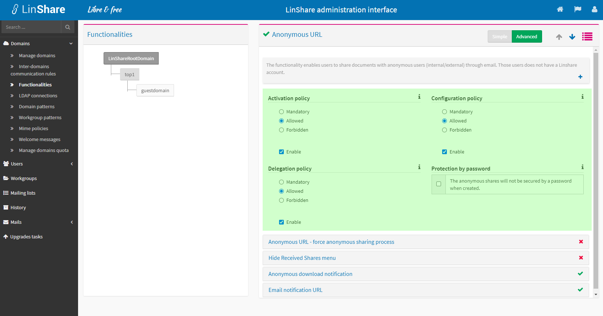
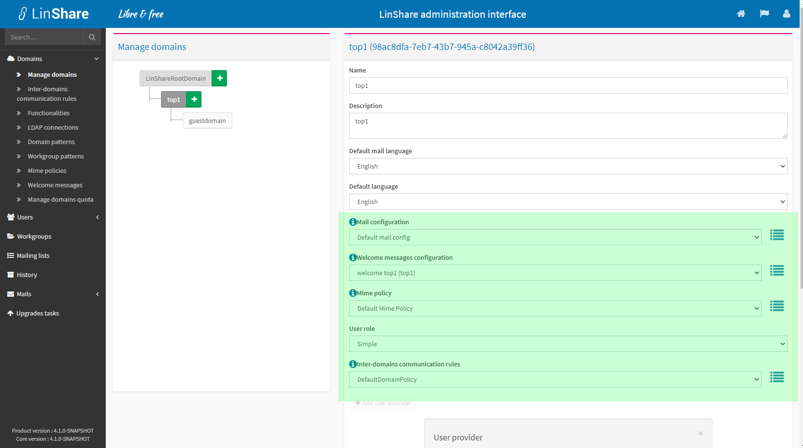
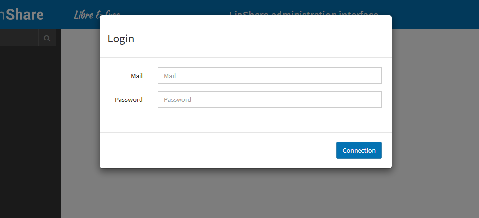
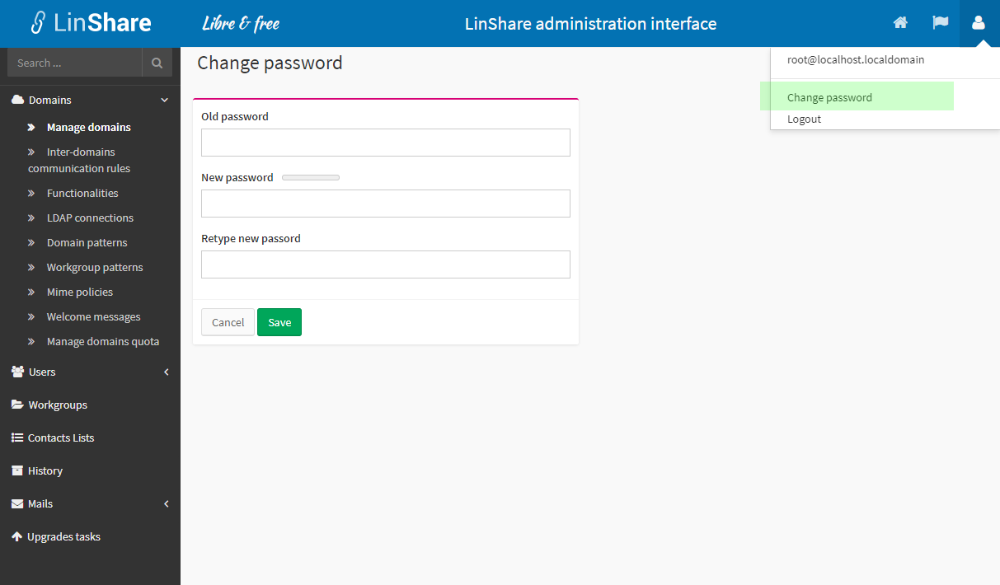
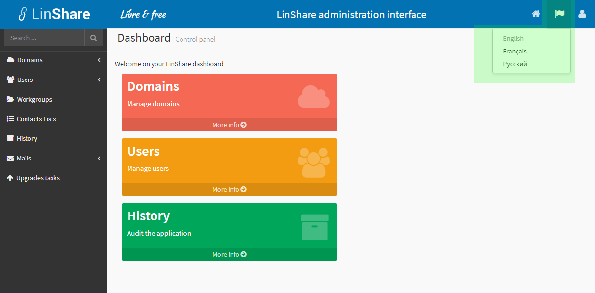
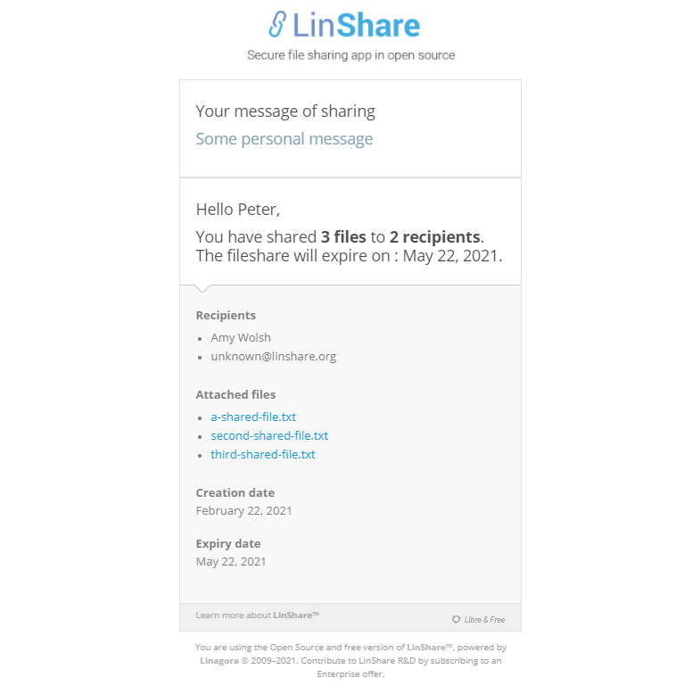
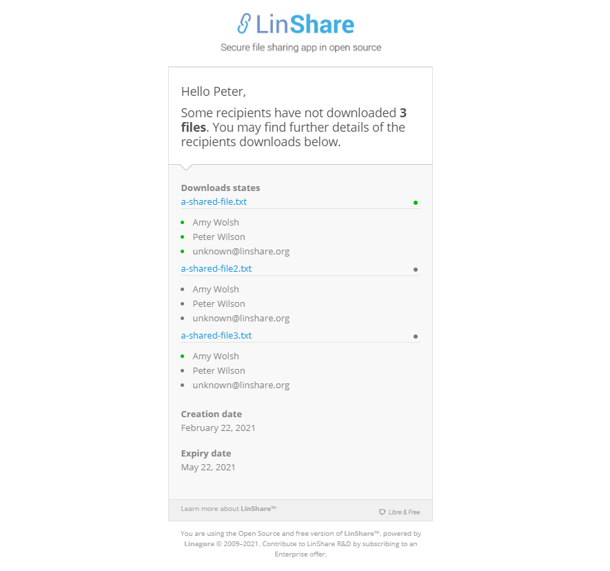

# Paramétrage applicatif

> Note :<br/>
Cette page est basée sur le contenu du document __Linagora_DOC_LinShare-1.7.0_Guide-Config-Admin_fr_20150303.odt__ (version **1.0** du **03/03/2015**). Ce document a été remplacé par cette page courante. Cette courante page est la version la plus actuelle.

> Note :<br/>
Pour des raisons de maintenabilité de la documentation, toute capture d'écran de ce présent document est en anglais.

   * [1. AVANT-PROPOS](#num01)
   * [2. CONSOLE D'ADMINISTRATION DE LINSHARE](#num02)
   * [3. GENERAL](#num04)
      * [Général : Connexion](#num05)
      * [Général : Changement du mot de passe](#num06)
      * [Général : Changer la langue de l’interface](#num07)
   * [4. DOMAINES](#num1)
      * [Domaines : Configuration des domaines](#num11)
      * [Domaines : Règles de communication inter-domaines](#num12)
      * [Domaines : Fonctionnalités](#num13)
      * [Domaines : Connexions LDAP](#num14)
      * [Domaines : Modèles de domaine](#num15)
      * [Domaines : Modèles de groupe de travail](#num16)
      * [Domaines : Règles de typeMIME](#num17)
      * [Domaines : Messages d'accueil](#num18)
      * [Domaines : Configuration du quota des domaines](#num19)
   * [5. UTILISATEURS](#num2)
      * [Utilisateurs : Configuration des utilisateurs](#num21)
      * [Utilisateurs : Utilisateurs incohérents](#num22)
      * [Utilisateurs : Comptes techniques](#num23)
   * [6. GROUPES DE TRAVAIL](#num3)
   * [7. LISTES DE DIFFUSION](#num4)
   * [8. HISTORIQUE (AUDIT)](#num5)
   * [9. COURRIELS](#num6)
      * [Courriels : Configuration de courriel](#num61)
      * [Courriels : Structure de courriel](#num62)
      * [Courriels : Pied de courriel](#num63)
      * [Courriels : Contenu de courriel](#num64)
      * [Courriels : Activation des notifications](#num65)
   * [10. TÂCHES DE MISE A JOUR](#num7)

Le paramétrage applicatif est réalisé via l’__interface web d’administration__ de LinShare.

## <a name="num01">1. AVANT-PROPOS</a>

Ce chapitre décrit les grand principes de fonctionnement de Linshare, et sa compréhension est indispensable à la bonne prise en main de l'outil.

### <ins>Principe 1 : La hiérarchisation des domaines</ins>


LinShare s’appuie sur un __système de gestion par domaine__ pour les besoins suivants :

-   les accès aux annuaires (de type LDAP ou Active Directory) ;
-   l’activation des fonctionnalités existantes dans LinShare ;
-   la configuration de ses fonctionnalités.

Dans LinShare, les domaines sont structurés selon le modèle hiérarchique suivant :


- Le __domaine __Root____ 
: C'est la racine de tous les domaines. Ce domaine ne possède pas d'utilisateurs (en dehors du compte root) et n'a donc pas d'objets de configuration à paramétrer : il sert donc uniquement à définir les paramétrages par défaut des fonctionnalités pour toute l'application (les sous domaines). Ce domaine __Root__ possède un ou plusieurs domaines sous son contrôle : les domaines __Top__.

- Le __domaine __Top____ : il possède un ou plusieurs sous-domaines appelés __domaines __Sub____ et un __domaine __Guest____ optionnel (pour les comptes invités).

- Le __domaine Sub__ : C'est le dernier niveau de domaine, il ne possède donc pas de sous-domaine.


Cette gestion hiérarchique en cascade est utile à plusieurs niveau, par exemple, chaque administrateur possède les droits d’administration sur le ou les domaine(s) auquel(s) il est rattaché ainsi que sur tous les sous-domaines : Une population d’administrateurs peut donc être associée au domaine __Top__ tandis que les utilisateurs seront associés aux domaines __Sub__. 


L’__ajout d’un domaine__ dans LinShare est réalisé selon les étapes suivantes :

1.  Configuration de la connexion à un annuaire LDAP ;
2.  Création d’un modèle de domaines ;
3.  Création d’un domaine __Top__ ;
4.  Création de sous-domaines __Sub__ et d’un domaine «__Guest__»


_Note concernant les comptes invités : Lors de création d’un __compte invité__, les domaines de type __Sub__ recherchent le domaine invité au même niveau, alors que les domaines de type __Top__ le recherchent dans leurs sous-domaines._


### <ins>Principe 2 : Héritage et propagation des droits</ins>


La __configuration des fonctionnalités est liée à un domaine__ et suit le principe de  fonctionnement en "cascade hiérarchique" décrit plus haut, : Si aucune modification de fonctionnalités n’a été faite sur un domaine inférieur, alors __LinShare se base sur le paramétrage du domaine supérieur__.

Par exemple, si je définie une configuration dans le domaine Root, alors l'ensemble des sous-domaines bénéficiera de cette configuration.

Grâce à cette hiérarchie, il est possible de __définir une configuration par défaut et maximale__ pour certains sous-domaines tout en __laissant quelques fonctionnalités personnalisables__ par sous-domaines.

Par exemple, si je restreins la configuration du domaine Root, les sous-domaines ne pourront modifier <ins>au mieux</ins> que ce que permet le domaine root, mais <ins>jamais davantage</ins>.

Note : Les différentes options de droits seront décrites plus en détail dans le chapitre dédié.





### <ins>Principe 3 : La création d'objets de configuration</ins>

Les __objets de configuration__ sont des entités qui, une fois crées, peuvent être rattachées à des domaines afin de définir certains paramètres (message d'accueil, etc) pouvant être exclusifs ou communs à plusieurs domaines.

Dans LinShare __la création de ces objets est indépendante de leur rattachement à un domaine__, ce qui permet de les utiliser pour plusieurs domaines différents, et elle reste soumise au principe de cascade hiérarchique : un objet de configuration créé dans un domaine ne sera utilisable que par ce domaine ET par tous ses sous-domaines.

__Il est donc important__, lorsqu'on crée un objet au sein d'un domaine, __de veiller ensuite à l'attribuer au(x) domaine(s) souhaité(s).__





## <a name="num02">2. CONSOLE D'ADMINISTRATION DE LINSHARE</a>

Ce portail permet d'accéder à une grande partie de la configuration de votre instance LinShare (en complément du fichier de configuration) : Par défaut elle est accessible à l'url http://linshare-admin.local/ .

#### Page d’accueil de LinShare Administration


#### Agencement d’une page

Toutes les pages de rubrique dans LinShare sont découpées en __plusieurs panneaux__ :

1.  __Menu de navigation :__ pour accéder aux rubriques ;
2.  __Panneau __Paramétrage de l’accès__ :__ langue, mot de passe, déconnexion ;
3.  __Zone principale :__ information, formulaire, etc.

## <a name="num04">3. GENERAL</a>

### <a name="num05"><ins>Général : Connexion</ins></a>

La connexion à l'administration de LinShare se fait dès l'accès à l'Url. Celle-ci se fait obligatoirement par login/motdepasse (pas de connexion automatique via un SSO). Seules les utilisateurs avec des profils d'administrateurs peuvent accéder à l'interface d'administration.

#### Synoptique

Pré-requis :

-   aucun.

Opérations :

1.  Depuis votre navigateur web, allez à l’adresse de l’application ;
>Note :<br/>
L’interface est en langue anglo-saxonne, car comme l’utilisateur n’a pas encore authentifié, il n’est pas possible de déterminer sa langue préférée.

2.  Saisissez vos identifiant et mot de passe, puis cliquez sur le bouton __Connexion__.



### <a name="num06"><ins>Général : Changement du mot de passe</ins></a>

Seul l'utilsateur __root@localhost.localdomain__ est autorisé à modifier son mot de passe : les autres utilisateurs provenants de l'annuaire devront se référer à leur système de gestion d'identité.

#### Synoptique

Pré-requis :

-   être connecté en tant que  __root@localhost.localdomain__

Opérations :

1.  Depuis l’en-tête de la page de connexion, cliquez sur le lien de son compte, et sélectionner __Modifier le mot de passe__ ;

2.  Saisissez votre ancien mot de passe, puis deux fois le nouveau.



### <a name="num07"><ins>Général : Changer la langue de l’interface</ins></a>

Il est possible de modifier individuellement la langue d'affichage de l'interface d'administration.

#### Synoptique

Pré-requis :

-   aucun.

Opérations :

1.  Depuis l’en-tête de n’importe quelle page, cliquez sur un le lien de sélection de langue.



## <a name="num1">4. DOMAINES</a>

### <a name="num11"><ins>Domaines : Configuration des domaines</ins></a>

Ce menu permet de créer, modifier et supprimer des domaines au sein de LinShare.

#### Synoptique

Pré-requis :

-   connexion LDAP : si l’on souhaite lier une population au nouveau domaine ;
-   modèle de domaine : si l’on souhaite lier une population au nouveau domaine.

Opérations :

1.  Depuis le menu de navigation, allez à la rubrique __Domaines  Configuration des domaines__ ;

2.  Cliquer sur __+__ à droite du __RootDomain__, afin d'ajouter un __top domain__ 

3.  Saisissez des valeurs dans les champs du formulaire, puis cliquez sur le bouton __Sauvegarder__.


#### Description des champs : Domaine __Top__

Paramètres pour un domaine __Top__ :
-   __Nom :__ un identifiant unique pour le domaine ;
-   __Description :__ une description du domaine ;
-   __Langue des mails par défaut :__ Anglais, Français ou Russe ;
-   __Langue par défaut :__ Anglais, Français, Vietnamien ou Russe ;
-   __Configuration de courriel :__ ??? ;
-   __Configuration des messages d'accueil :__ ;
-   __Politique de type MIME :__ ;
-   __Rôle de l’utilisateur :__ le rôle des utilisateurs de ce domaine ;
-   __Règles de communication inter-domaines :__ ??? ;
-   __Connexion LDAP:__ profil de connexion LDAP à utiliser\* ;
-   __Modèle de domaine :__ le modèle de domaine à utiliser\* ;
-   __Base dn :__ chemin vers l'Organizational Unit qui contient les utilisateurs\* ;

\*Champ optionnel lorsque l’on ne souhaite pas lier une population d’utilisateurs au domaine.

#### Description des champs : Sous-domaines __Sub__ et __Guest__

On peut créer un sous-domaine __Sub__ de la même manière qu’un domaine __Top__.

En revanche, un domaine __Guest__ aura moins de paramètres.

Paramètres pour un sous-domaine __Guest__ :
-   __Nom__ ;
-   __Description__ ;
-   __Langue des mails par défaut__ ;
-   __Langue par défaut__ ;
-   __Configuration de courriel__ ;
-   __Configuration des messages d'accueil__ ;
-   __Politique de type MIME__ ;
-   __Règles de communication inter-domaines__.

### <a name="num12"><ins>Domaines : Règles de communication inter-domaines</ins></a>

Ce menu permet de définir des règles afin d'autoriser des domaines à intéragir entre eux : cela permet aux utilisateurs de retrouver (par auto-complétion) les utilisateurs d'autres domaines dans le cadre d'un partage, d'un ajout de membre dans un groupe...

#### Synoptique

Pré-requis :

-   au moins un domaine doit exister.

Opérations :

1.  Depuis le menu de navigation, allez à la rubrique __Domaines  Règles de communication inter-domaines__ : la liste des politiques de domaines s'affiche ;

2.  Cliquer sur l'un des politiques : ses règles s'affichent.


3.  Il est alors possible d'ajouter éventuellement des règles pour chaque domaine : __Autorisé__, __Tout autorisé__, __Interdit__, __Tout interdit__.

### <a name="num13"><ins>Domaines : Fonctionnalités</ins></a>

Ce menu dresse la liste des différentes fonctionnalités disponibles pour chaque domaine. Il est alors possible de les configurer.

#### Synoptique

Pré-requis :

-   Aucun.

Opérations :

1.  Depuis le menu de navigation, allez à la rubrique __Domaines  Fonctionnalités__ : la liste des fonctionnalités et de leurs statuts s'affiche ;


2.  Cliquer sur l'une des fonctionnalités : il est alors possible d'activer ou de désactiver la fonctionnalité.

3.  Il est possible de cliquer sur __Avancé__ pour configurer les détails de la fonctionnalité. Les détails varient d'une fonctionnalité à une autre :


### Liste des différentes fonctonnalités de LinShare :


#### <ins>URL anonyme</ins>

Les URLs anonymes permettent de partager un fichier vers un utilisateur anonyme (une personne possédant une adresse de courriel), c'est à dire un utilisateur qui ne possède pas de compte dans l’application LinShare (interne ou invité).

* __URL anonymes - forcer le partage en anonyme :__ En activant cette fonctionnalité, l'utilisateur peut choisir de partager uniquement via les URLs anonymes. Dans ce cas, les utilisateurs internes ne recevront plus le partage dans leur Partage Reçus.
* __Cacher le menu Partages Reçus :__ En activant cette fonctionnalité, les utilisateurs internes n'auront plus l'accès à leur Espace Partage Reçus.
* __Notification de téléchargement__ : La notification de téléchargement d'un document via les urls anonymes sera envoyée à chaque téléchargement, ou seulement au premier téléchargement.
* __URL de notification courriel :__ Permet de configurer le lien qui redirige vers le portail de téléversement (utilisé dans le mail envoyé pour le partage avec un utilisateur 'anonyme').


#### <ins>Antivirus</ins>

Les antivirus sont des logiciels conçus pour identifier, neutraliser et éliminer des logiciels malveillants. Ils peuvent modifier ou supprimer des fichiers infectés. En activant l'antivirus sur votre application LinShare celui-ci analysera automatiquement les fichiers au moment où ils sont déposés. Son analyse contribue à la protection de tous les utilisateurs de LinShare et évitent que les virus ne se propagent. Si un document s'avère être malveillant il sera alors rejeté et son expéditeur sera prévenu.

Note : Pour fonctionner, l'antivurus doit également avoir été installé et configuré dans le fichier linshare.properties.


#### <ins>Complétion</ins>

La complétion permet de compléter automatiquement la saisie d'une chaîne de caractère saisie au clavier, c'est-à-dire l'aide à la saisie d'informations dans un champ lié à une source de données. Vous pouvez configurer soit le seuil de complétion, soit le nombre de caractères à partir duquel cette auto-complétion est réalisée.


#### <ins>Liste de contacts</ins>

Cette fonctionnalité permet la création d'une liste de contacts contenant des adresses courriels d'utilisateurs internes, externe ou anonyme.
Cette liste peut alors être directement sélectionnée comme destinaitaire (à la place de la saisie manuelle), comme par exemple dans le cas d'un partage de fichier.

* __Droit de création :__ Permet d'autoriser les utilisateurs à créer des listes de contacts.


#### <ins>Expiration de document</ins>

Cette fonctionnalité permet de définir une valeur d'expiration pour les documents déposés sur LinShare. Un document déposé mais non partagé possède une date d'expiration par défaut. Lorsque le dernier partage d'un document est supprimé, on calcule une date d'expiration pour ce document.

#### <ins>Domaine</ins>

Permet la configuration des paramètres généraux du domaine.

* __Adresse de courriel du domaine :__ C'est l'adresse qui sera utilisée comme envoyeur ("sender") dans tous les mails envoyés par linshare.
* __URL de base pour les notifications par courriel :__ Cette fonctionnalité vous permet de définir l’URL de base pour les notifications par courriel. Avant la version 1.3.0 de LinShare ce paramétrage était réalisé dans le fichier de configuration de LinShare et était donc global à l’application.


#### <ins>Invités</ins>

En activant cette fonctionnalité vous permettrez aux utilisateurs interne de créer des comptes temporaires pour vos invités. Ils pourront télécharger les documents, en déposer et en envoyer (si vous activez 'L'envoi de fichiers' pour les invités).

* __Envoi de fichiers :__ L'activation de ce paramètre vous permet d'autoriser les invités à déposer des fichiers, leur donnant ainsi accès à l'onglet "mon espace" qui permet de partager des fichiers. Ce paramétrage peut également être modifié pour des utilisateurs déjà existant dans la page d'édition de leur profil
* __Expiration des comptes invités :__ Les comptes invités sont toujours soumis à une date d'expiration. Vous devez configurer un délai d’expiration pour ces derniers. Vous pouvez également autoriser les utilisateurs internes à personnaliser cette date d'expiration.
* __Autoriser la prolongation de la date d'expiration des invités :__ Cette fonctionnalité permet d'autoriser les utilisateurs à modifier la date d'expiration d'un invité, de repousser indéfiniment sa date d'expiration lors de l'édition.
* __Restriction de contacts :__ Vous pouvez restreindre les invités à partager avec une liste restreinte de contacts. Cette liste est personnelle, par défaut elle est initialisé avec l'adresse de courriel du créateur de l'invité


#### <ins>Envoi de fichiers</ins>

L'envoi de fichier permet aux utilisateurs interne le téléversement de fichiers, via l'activation de leur espace personnel, leur donnant ainsi accès au partage de documents.


#### <ins>Jeton JWT permanent</ins>

Cette fonctionnalité permet aux utilisateurs et administrateurs de créer, utiliser et supprimer les jetons JWT permanents, permettant ainsi aux utilisateurs de créer un lien permanent entre une application client et linshare, telle que l'application mobile.

* __Jeton JWT permanent pour les utilisateurs :__ Cette fonctionnalité permet aux utilisateurs de contrôler l'utilisation des jetons JWT permanents


#### <ins>Type MIME</ins>

Gestion des règle de type MIME : Cette fonctionnalité vous permet de paramétrer les filtres par type MIME. Ainsi vous pouvez autoriser ou interdire le dépôt de fichiers d’un type donné, e.g. interdire le dépôt de fichiers vidéos (MPEG, etc.) : c'est le principe d'une liste blanche.

Une fois activée :

1. Depuis le menu de navigation, allez à la rubrique « Paramètres > Règles de type MIME » ;
2. Sélectionnez un domaine depuis l’« Arbre des domaines », cliquer sur le bouton « Ajouter » ;
3. Cliquer sur le filtre « Mon filtre » ;
4. Pour chaque type MIME, activez-le ou désactivez-le, puis enregistrez en cliquant sur le bouton « Soumettre ».
5. Enfin, rendez-vous dans l'édition du domaine pour l'utiliser.


#### <ins>Authentification double facteur</ins>

La fonctionnalité permet de rendre l'authentification à double facteur disponible pour les utilisateurs, voir même de la rendre obligatoire. Attention : Toute modification apportée sur cette page affecterait tous les utilisateurs de LinShare 


#### <ins>Accusé de partage</ins>

Lors d'un partage, l'émetteur peut recevoir un récapitulatif des documents et destinataires de son partage via un courriel.



#### <ins>Expiration de partage</ins>

L’expiration de partage : Les partages sont des liens entre un document présent dans l'espace personnel de l'utilisateur et un destinataire (adresse de courriel). Il est possible de limiter la durée de vie de ces liens via cette fonctionnalité. Une fois le partage expiré, le lien sera détruit. Tous accès à la ressource sera alors impossible. L'administrateur peut configurer le délais d'expiration des partages ainsi que le droit des utilisateurs à modifier cette valeur. Ce délais permet de calculer la date d'expiration par défaut ainsi que la date d'expiration maximale.La fonctionnalité 'Suppression des fichiers lors de l'expiration des partages' permet de supprimer le document sous-jacent à un partage lors de l'expiration du dernier partage associé

* __Suppression des fichiers lors de l'expiration des partages :__ Lorsque le dernier partage associé à un document sera supprimé, le document sera automatiquement supprimé.


#### <ins>Alerte de non téléchargement</ins>

En activant cette fonctionalité, les utilisateurs auront la possibilité de demander une alerte de non téléchargement de fichiers lors d'un partage. L'alerte est envoyée si au moins un document du partage n'a pas été téléchargé par au moins un destinataire. 

* __Alerte de non téléchargement - Nombre de jours avant notification :__ Ceci représente le nombre de jours que vous paramétrez avant de recevoir l'alerte.




#### <ins>Invitation de dépôt (LinShare 4.1+)</ins> 

Une invitation de dépôt est l'ouverture temporaire et réglementée pour un utilisateur externe, de déposer des fichiers dans l'espace personnel d'un utilisateur.

* __Droit de clôture :__
  * Clôturer l'invitation de dépôt (emetteur/destinataire)
    * L'emetteur et le destinataires peuvent clôturer une invitation de dépôt.
    * Le destinaitaire ne pourra alors plus modifier, ajouter ou supprimer des documents dans le dépôt.
    * Le dépôt apparaîtra alors comme "clôturé" dans l'interface.
    * Quand une invitation de dépôt expire, elle est automatiquement clôturée.
* __Droit de suppression de fichiers pour le destinataire :__ Le destinataire d'une invitation de dépôt pourra supprimer des fichiers selon le paramétrage de l'invitation. 
* __Délais avant activation :__ Le délai entre la date de création de l'invitation de dépôt et sa date d'activation (la demande de téléchargement est disponible et les utilisateurs peuvent téléverser des documents) 
* __Délais avant expiration :__ La délais avant expiration est utilisée pour calculer la date d'expiration de l'invitation à partir de sa date d'activation. L'expiration d'une invitation intervient à minuit le lendemain de la date d'expiration. Exemple : une expiration instanciée pour le 3 janvier prend effet le 4 janvier à minuit. La vérification et l'expiration s'effectue via une tâche planifiée qui s'exécute toutes les heures afin d'activer/clôturer les invitations.
* __Délais avant notification d'expiration :__  Cette notification permet d'indiquer à l'émetteur et au destinataire que l'invitation est sur le point d'expirer. La durée qui sépare la date d'envoi de la notification et la date d'expiration de l'invitation est configurable. 
* __Taille maximale du dépôt :__ La taille maximale du dépôt limites les utilisateurs à ajouter des fichiers jusqu'a la taille limite définie du dépôt. 
* __Nombre maximum de fichiers :__ Le nombre maximum de fichiers permet de limiter le nombre de fichiers à déposer dans le dépôt dans la limite de la taille du dépôt.
* __Taille maximale d'un fichier :__ Permet de limiter la taille de chaque fichier deposé par les utilisateurs dans le dépôt. 
* __Langue d'émission des courriels :__ Configurer La langue par défaut des notifications envoyé par le système. 
* __Protection par mot de passe des URLs :__ Une fois activée, les URLS seront protégés par un mot de passe à usage unique. Le mot de passe est généré par le serveur est envoyé par courriel séparé au(x) destinataire(s).


#### <ins>Groupe de Travail</ins>

Cette fonctionnalité permet de gérer les droits des groupes de travails.

* __Droit de création :__ Permet d'autoriser ou non la création d'un groupe de travail par les utilisateurs.
* __Droit de téléchargment d'un dossier :__ Permet d'autoriser ou non le téléchargement d'un dossier dans un groupe de travail par les utilisateurs, et d'en définir la taille maximale.
* __Droit de création des versions de fichiers :__ Permet d'autoriser le versionnage d'un fichier.


### <a name="num14"><ins>Domaines : Connexion LDAP</ins></a>

Ce menu permet de créer une ou plusieurs connexion(s) entre LinShare et un annuaire LDAP (OpenLDAP, ActiveDirectory...).

#### Synoptique

Pré-requis :

-   pré-requis à l’utilisation : accès à un annuaire de type LDAP.

Opérations :

1.  Depuis le menu de navigation, allez à la rubrique __Domaines  Connexion LDAP__ : la liste des connexions LDAP disponibles s'affiche ;

2.  Cliquer sur l'une des connexions LDAP disponible ou créer une nouvelle connexion LDAP : ses paramètres s'affichent.


#### Description des champs : Connexion LDAP

Les paramètres d’une connexion LDAP sont les suivants :

-   __URL du fournisseur :__ adresse URI selon la syntaxe suivante : `{ldap|ldaps}://{ip|hostname}:port`
-   __LDAP 'user dn' :__ DN du compte d’accès\* à l’annuaire LDAP

>Note :<br/>
Le DN est différent d'un utilisateur standard du LDAP. En effet, il s'agit ici du Manager, qui n'est pas dans une __Organizational Unit__ comme tout autre compte LDAP standard.

-   __LDAP 'password' :__ mot de passe\* du compte d’accès à l’annuaire

\*Champs optionnels dans le cas d’une connexion anonyme.

>Attention :<br/>
L’indisponibilité d’un annuaire paralyse fortement le fonctionnement de l’application. En effet, le cœur de LinShare s’appuie sur les annuaires, beaucoup d’opérations seront donc impossibles.

### <a name="num15"><ins>Domaines : Modèle de domaines</ins></a>

Ce menu permet de créer des filtres pour récupérer des utilisateurs depuis l'annuaire. Par défaut les filtres ne sont pas associés à des domaines, mais il est nécessaire de les attribuer à des domaines pour qu'ils puissent fonctionner.
Une fois attribué à un domaine, le filtre pourra récupérer les utilisateurs tel que configuré à la création du filtre.

> Attention : un utilisateur ne doit pas être présent dans plusieurs domaines : il faut donc veiller à ce qu'il n'y ait pas de conflits entre les filtres.

#### Synoptique

Pré-requis :

-   aucun.

Opérations :

1.  Depuis le menu de navigation, allez à la rubrique __Domaines  Modèle de domaines__ : la liste des modèles de domaine s'affiche ;

2.  Cliquer sur l'un des modèles de domaine ou créer un nouveau modèle de domaine : ses paramètres s'affichent.


#### Description des champs : Modèle de domaines

Un modèle de domaines permet de définir comment récupérer les informations liées aux utilisateurs (nom, prénom, adresse électronique) et où les trouver (groupes, branches, attributs).

Les différentes commandes définies dans un modèle de domaines sont des requêtes LDAP en JavaScript (LQL : Ldap Query Language). Ces requêtes permettent une grande souplesse d'intégration avec un annuaire. Une requête retourne une liste de DN *(Distinguished Name)*.

Voir [LQL-function.md)(LQL-function.md) pour plus de détails.

Les paramètres d’un modèle de domaines sont les suivants :

-   __Name :__ description distinct du modèle ;

-   __Description :__ description succincte du modèle ;

-   __Commande d'authentification :__ cette commande est utilisée pour l’authentification à LinShare. Elle doit retourner une liste contenant un seul élément ;
>Exemple :<br/>
```
ldap.search(domain, "(&(objectClass=inetOrgPerson)(mail=*)(givenName=*)(sn=*)(|(mail="+login+")(uid="+login+")))");
```

-   __Commande utilisateur :__ cette commande est utilisée pour rechercher un utilisateur de LinShare ;
>Exemple :<br/>
```
ldap.search(domain, "(&(objectClass=inetOrgPerson)(mail="+mail+")(givenName="+first_name+")(sn="+last_name+"))");
```

-   __Commande d'autocompletion sur tous les attributs:__ cette commande est utilisée pour autocompléter un utilisateur sur tous les attributs comme le courriel, le prénom et le nom ;
>Exemple :<br/>
```
ldap.search(domain, "(&(objectClass=inetOrgPerson)(mail=*)(givenName=*)(sn=*)(|(mail=" + pattern + ")(sn=" + pattern + ")(givenName=" + pattern + ")))");
```

-   __Commande d'autocompletion sur le prénom et le nom:__ cette commande est utilisée pour autocompléter un utilisateur sur les attributs prénom et nom ;
>Exemple :<br/>
```
ldap.search(domain, "(&(objectClass=inetOrgPerson)(mail=*)(givenName=*)(sn=*)(|(&(sn=" + first_name + ")(givenName=" + last_name + "))(&(sn=" + last_name + ")(givenName=" + first_name + "))))");
```


-   __Attribut email :__ ce champ contient le nom de l’attribut LDAP contenant une adresse électronique dans l’annuaire ;
>Exemple :<br/>
`mail`

-   __Attribut prénom :__ ce champ contient le nom de l’attribut LDAP contenant un prénom dans l’annuaire ;
>Exemple :<br/>
`givenName`

-   __Attribut nom de famille :__ ce champ contient le nom de l’attribut contenant un nom de famille dans l’annuaire ;
>Exemple :<br/>
`sn`

-   __Attribut Identifiant unique utilisateur :__ permet de renseigner une clé unique d’identification immuable de l’utilisateur, tel qu’un __*uid__* ou __*sAMAccountName__*. À défaut on peut également utiliser l’adresse de courriel de la personne ;
>Exemple :<br/>
`uid`

-   __Taille de page de recherche :__ permet de configurer la manière dont LinShare récupère les résultats de l’annuaire. Il indique un nombre maximum de résultats par page lors d’une recherche ;

    Par défaut, ce paramètre est fixé à 100 résultats.

    La valeur zéro désactive la pagination.

-   __Limite de recherche :__ permet de configurer le nombre maximum de résultats retournés par l’annuaire lors d’une recherche.

    Par défaut, ce paramètre est fixé à 100 résultats. Généralement, l’utilisateur n’a pas besoin de lister l’intégralité de l’annuaire, surtout si celui-ci contient des centaines de milliers d'utilisateurs.

    La valeur zéro désactive la limite de résultats.

-   __Taille de page de complétion :__ permet de configurer la manière dont LinShare récupère les résultats de l’annuaire. Il indique un nombre maximum de résultats par page lors d’une auto complétion.

    Par défaut, ce paramètre est fixé à 10 résultats.

    La valeur zéro désactive la pagination.

-   __Completion limit :__ permet de configurer le nombre maximum de résultats retournés par l’annuaire lors d’une auto complétion.

    Par défaut, ce paramètre est fixé à 10 résultats. En effet, il est inutile de retourner tous résultats possibles, potentiellement des centaines voire des milliers d’utilisateurs.

    La valeur zéro désactive la limite de résultats.

### <a name="num16"><ins>Domaines : Modèles de groupe de travail</ins></a>

Ce menu fonctionne de manière identique au précédent, à la différence qu'il récupère les groupes LDAP et non les utilisateurs, afin de créer des "groupes de travail" dans LinShare.


#### Synoptique

Pré-requis :

-   aucun.

Opérations :

1.  Depuis le menu de navigation, allez à la rubrique __Domaines  Modèles de groupe de travail__ : la liste des modèles de groupe de travail s'affiche ;

2.  Cliquer sur l'un des modèles de groupe de travail ou créer un nouveau modèle de groupe de travail : ses paramètres s'affichent.


#### Description des champs : Modèles de groupe de travail

Un modèle de groupe de travail permet de définir comment récupérer les informations liées aux membres de celui-ci (nom, prénom, adresse électronique des membres) et où les trouver.

Les différentes commandes définies dans un modèle de groupe de travail sont des requêtes LDAP en JavaScript (LQL : Ldap Query Language). Ces requêtes permettent une grande souplesse d'intégration avec un annuaire. Une requête retourne une liste de DN *(Distinguished Name)*.

Voir [LQL-function.md)(LQL-function.md) pour plus de détails.

Les paramètres d’un modèle de groupe de travail sont les suivants :

-   __Label :__ description distinct du modèle ;

-   __Description :__ description succincte du modèle ;

-   __Commande de Recherche de tous les groupes de travail :__ cette commande est utilisée pour rechercher tous les groupes de travail ;
>Exemple :<br/>
```
ldap.search(baseDn, "(&(objectClass=groupOfNames)(cn=workgroup-*))");
```

-   __Commande de Recherche d'un groupe de travail :__ cette commande est utilisée  pour rechercher un groupe de travail ;
>Exemple :<br/>
```
ldap.search(baseDn, "(&(objectClass=groupOfNames)(cn=workgroup-" + pattern + "))");
```


-   __Attribut email du membre :__ ce champ contient le nom de l’attribut LDAP contenant une adresse électronique dans l’annuaire ;
>Exemple :<br/>
`mail`

-   __Attribut prénom du membre :__ ce champ contient le nom de l’attribut LDAP contenant un prénom dans l’annuaire ;
>Exemple :<br/>
`givenName`

-   __Attribut nom de famille du membre :__ ce champ contient le nom de l’attribut contenant un nom de famille dans l’annuaire ;
>Exemple :<br/>
`sn`

-   __Attribut préfix du groupe de travail :__ l'objet LDAP standard __groupOfNames__ est défini avec un préfix dans son nom, afin de le différencier des autres objects de ce type qui pourraient être utilisés par une autre application dans l'organisation. Son préfix est fixé à `workgroup-` La valeur de ce champ permet ici de masquer ce préfix dans l'application, pas de définir le préfix qui va être utilisé.
>Exemple :<br/>
`workgroup-`

-   __Attribut nom du groupe de travail :__ permet de renseigner un nom distinctif pour le groupe de travail.
>Exemple :<br/>
`cn`

-   __Attribut membre du groupe de travail :__ permet de spécifier l'attribut LDAP de l'objet LDAP __groupOfNames__ qui est utilisé ici.
>Exemple :<br/>
`member`

-   __Taille de page de recherche :__ permet de configurer la manière dont LinShare récupère les résultats de l’annuaire. Il indique un nombre maximum de résultats par page lors d’une recherche ;

    Par défaut, ce paramètre est fixé à 100 résultats.

    La valeur zéro désactive la pagination.

Vous trouverez des informations plus détaillées concernant la synchonisation des groupes entre LinShare et LDAP ici : https://ci.linagora.com/linagora/lgs/linshare/products/linshare-github/blob/master/documentation/EN/administration/ldap.md

### <a name="num17"><ins>Domaines : Règles de type MIME</ins></a>

Ce menu permet de définir la liste blanche des fichiers qui seront autorisés à être déposés dans LinShare.

#### Synoptique

Pré-requis :

-   aucun.

Opérations :

1.  Depuis le menu de navigation, allez à la rubrique __Domaines  Règles de type MIME__ : la liste des politiques s'affiche ;

2.  Cliquer sur l'une des politiques : les détails s'affichent pour chaque extension de fichier : il est alors possible d'autoriser ou de bloquer les fichiers par extension.


### <a name="num18"><ins>Domaines : Messages d'accueil</ins></a>

Ce menu permet de définir le message d'accueil qui apparaîtra sur l'interface utilisateur de LinShare.

#### Synoptique

Pré-requis :

-   aucun.

Opérations :

>Note :<br/>
Il s'agit ici du message qui s'affiche sur la page d'accueil de l'interface utilisateur.


1.  Depuis le menu de navigation, allez à la rubrique __Domaines  Messages d'accueil__ : la liste des messages s'affiche ;

2.  Cliquer sur l'un des messages : il est possible de modifier le message dans les langes suivantes : __Anglais, Français, Russe__ et __Vietnamien__. De plus il est possible d'assigner les domaines à ce message.


### <a name="num19"><ins>Domaines : Configuration du quota des domaines</ins></a>

Ce menu permet de gérer les différents espaces de stockage alloués en fonction du __domaine__, des __conteneurs__ (groupes de travail / utilisateurs) et des __utilisateurs__.

* __L'espace de stockage du Domaine__ permet de définir le quota maximal de fichiers stockables sur l'ensemble du domaine _(ex : un Domaine de 50 Go)_.
* __L'espace de stockage des Conteneurs__ permets de définir de manière indépendante le quota maximal de fichiers stockables sur les groupes de travail et sur les groupes utilisateurs, dans la limite de celle du Domaine _(Ex : 30 Go pour les groupes de travail et 20 Go pour les groupes d'utilisateur, soit 50 Go au total pour le Domaine)_.
* __L'espace de stockage des Utilisateurs__ permet de définir le quota maximal de fichiers stockables pour chaque utilisateur, dans la limite de celle du Domaine et indépendamment des conteneurs _(Ex : je peux définir une limite à 50 Go pour chacun des 100 utilisateurs du domaine à 50 Go)_
(Note : cela ne fera pas "5000 Go de donnée utilisateur sur les 50 Go du domaine" => voir détail ci-dessous).

Il est important de comprendre que cette allocation s'effectue de manière __dynamique__ : il est possible d'allouer autant de stockage souhaités (dans la limite du domaine), mais __la limite du domaine ne pourra de toute manière jamais être dépassée__.

Dans l'exemple utilisé si dessus avec 100 utilisateurs disposants de 50 Go chacuns dans un domaine de 50 Go, si un utilisateur en utilise 40 Go alors les 99 autres utilisateurs n'aurons plus qu'une réserve de 10 Go à se partager.

A noter qu'il est également possible de définir __la taille maximale d'un fichier déposable__ pour les conteneurs et les utilisateurs _(ex : Une taille maximale autorisée de 200 Mo)_.

#### Synoptique

Pré-requis :

-   aucun.

Opérations :

1.  Depuis le menu de navigation, allez à la rubrique __Domaines  Configuration du quota des domaines__, puis sélectionner le domaine à configurer ;


Il y a 3 sections différentes :

>Note :<br />
Pour chaque section, le mode maintenance permet de bloquer tous les nouveaux transferts de fichier, sans interrompre les transferts en cours.

-     __Espace utilisé__ pour le domaine courant : dans cette section on trouve :
      -       un graphique montrant l'allocation des quotas du domaine courant
      -       la possibilité de définir une limite de quota total du domaine.

>Note :<br />
Si aucune limite n'est définie, la limite est héritée du domaine parent.

-     __Quota des espaces__ pour le domaine courant : dans cette section on trouve :
      -       un quota pour les espaces personnels : quota des espaces personnels et quota par utilisateur
      -       un quota pour les espaces communs.

-     __Paramétrages des quotas des sous-domaines__ : idem __Quota des espaces__, sauf que ces réglages vont être hérités aux domaines enfants du domaine courant.

## <a name="num2">5. UTILISATEURS</a>

### <a name="num21"><ins>Utilisateurs : Configuration des utilisateurs</ins></a>

Ce menu permet d'éditer le profil d'un utilisateur (nom, prénom, droits, etc).

#### Synoptique

Pré-requis :

-   aucun.

Opérations :

1.  Depuis le menu de navigation, allez à la rubrique __Utilisateurs  Configuration des utilisateurs__ ;

2.  Saisir un mot clé à rechercher dans un champ de recherche, puis presser la touche Entrée ; Cliquer sur le nom, pour éditer ses paramètres.


>Note :<br/>
Une __recherche simple__ porte simultanément sur les trois champs suivants : le nom, le prénom et l’adresse électronique. Pour des critères plus précis, faites une recherche avancée.

3.  Adapter les champs, puis cliquer sur le bouton __Sauvegarder__.


4.  Configurer le quota de l'espace personnel de l'utilisateur, puis cliquer sur le bouton __Sauvegarder__.


### <a name="num22"><ins>Utilisateurs : Utilisateurs incohérents</ins></a>

Ce menu permet de gérer les utilisateurs qui ont (encore) un compte LinShare, mais qui ne sont plus rattachés à un annuaire (personne quittant la société) ou qui ont changé de domaine.

> Note : les utilisateurs inconhérents ne peuvent plus se connecter à LinShare.

#### Synoptique

Pré-requis :

-   aucun.

Opérations :

>Note :<br />
Toute modification ou suppression d'un utilisateur sur l'annuaire LDAP entraîne sa catégorisation en utilisateur incohérent. C'est ensuite le rôle de l'administrateur de vérifier son statut manuellement via l'interface. L'objectif de cette fonctionnalité est d'éviter la suppression involontaire de tous les fichiers d'un colaborateur qui a quitté une entreprise par exemple.

1.  Depuis le menu de navigation, allez à la rubrique __Utilisateurs  Utilisateurs incohérents__.

2.  Saisir un mot clé à rechercher dans un champ de recherche, puis presser la touche Entrée: il est alors possible de visualiser la cohérence de l'utilisateur.


### <a name="num23"><ins>Utilisateurs : Comptes techniques</ins></a>

Ce menu permet de créer des comptes utilisés pour effectuer des opérations à la place d'utilisateurs : ils sont destinés à des applications, comme par exemple dans le cas d'un service de paie qui téléverse les bulletins de paie dans l'espace personnel des utilisateurs.

#### Synoptique

Pré-requis :

-   au moins un compte technique doit exister (c’est le cas par défaut : à l’installation de l’application, le compte technique pour le module __Demande de dépôt__ existe).

Opérations :

1.  Depuis le menu de navigation, allez à la rubrique __Utilisateurs  Comptes techniques__ : la liste des comptes techniques s'affiche.


2.  Ajouter un compte technique ou cliquer sur un compte technique déjà existant : un formulaire s'affiche avec les informations du compte, son statut (activé ou désactivé) et les permissions.


## <a name="num3">6. GROUPES DE TRAVAIL</a>

Un groupe de travail est un espace collaboratif permettant à plusieurs utilisateurs (internes et/ou invités) d'effectuer différentes opérations ( déposer, consulter, éditer, supprimer selon les permissions qui leur y sont attribuées) sur des fichiers.

Pré-requis :

-   au moins un groupe de travail avec au moins un membre doit être défini depuis l'interface utilisateur par un utilisateur LinShare.

Opérations :

1.  Depuis le menu de navigation, allez à la rubrique __GROUPES DE TRAVAIL__ ;

2.  Saisissez des critères de recherche, puis cliquez sur le bouton __Rechercher__ : les résultats s'affichent.

3.  Cliquez sur un groupe de travail : les détails s'affichent avec la liste de ses membres.


## <a name="num4">7. LISTES DE CONTACTS</a>

Précédement appelé "Liste de Diffusion", la liste de contact permet de créer une liste d'adresse mail. Cette liste est utile pour envoyer des fichiers de manière individuelle à un ensemble de personnes (c'est à dire que chaque personne à l'impression de recevoir un partage unique : il ne verra pas les autres utilisateurs destinataires).

Pré-requis :

-   au moins une liste de contacts a été défini dans l'interface utilisateur par un utilisateur LinShare.

Opérations :

1.  Depuis le menu de navigation, allez à la rubrique __LISTE DE CONTACTS__ : les différentes listes s'affichent.

2.  Cliquez sur une liste de contacts: la liste de ses membres s'affichent.


>Note:<br />
Bien qu'il ne soit pas possible pour l'administrateur de créer une liste de contacts, il est cependant tout à fait possible de modifier les listes existantes : ajouter, supprimer des membres, changer la visibilité de la liste, changer la description.

## <a name="num5">8. HISTORIQUE (AUDIT)</a>

Cette page permet d'afficher __l'ensemble des actions__ effectuées par les utilisateurs.

#### Synoptique

Pré-requis :

-   aucun.

Opérations :

1.  Depuis le menu de navigation, allez à la rubrique __HISTORIQUE__ ;

2.  Saisissez des critères de recherche, puis cliquez sur le bouton __Rechercher__.


## <a name="num6">9. COURRIELS</a>

### <a name="num61"><ins>Courriels : Configuration de courriel</ins></a>

Ce menu permet de configurer les templates de mails envoyés par LinShare. Chaque template utilisera la structure (layout) commune, un contenu et un pieds de page.

#### Synoptique

Pré-requis :

-   sélection du domaine sur lequel portera l’action, via le panneau __Sélection du domaine__.

Opérations :

1.  Depuis le menu de navigation, allez à la rubrique __Courriels  Configuration de courriel__ ;


2.  Sélectionner le domaine parent et cliquer sur __+__ pour créer une configuration de courriel, ou bien sélectionner une configuration de courriel déjà existante à modifier

3.  Dans chacune des trois zones de paramétrage, modifiez le texte souhaité.

### <a name="num62"><ins>Courriels : Structure de courriel</ins></a>

Ce menu permet de configurer la structure générale qu'utilisera LinShare pour l'ensemble des mails envoyés.
Il est possible de créer plusieurs structures, mais seule une structure pourra être utlisée par domaine.

#### Synoptique

Pré-requis :

-   sélection du domaine sur lequel portera l’action, via le panneau __Sélection du domaine__.

Opérations :

1.  Depuis le menu de navigation, allez à la rubrique __Courriels  Structure de courriel__ ;

2.  Sélectionner le domaine parent et cliquer sur __+__ pour créer une structure de courriel, ou bien sélectionner une structure de courriel déjà existante à modifier

3.  Dans chacune des trois zones de paramétrage, modifiez le texte souhaité.


>Note :<br />
Il existe une structure pour chaque langue d'affichage disponible sur LinShare : Anglais, Français et Russe.

### <a name="num63"><ins>Courriels : Pied de courriel</ins></a>

Ce menu permet de configurer la zone de pied de page.

#### Synoptique

Pré-requis :

-   sélection du domaine sur lequel portera l’action, via le panneau __Sélection du domaine__.

Opérations :

1.  Depuis le menu de navigation, allez à la rubrique __Courriels  Pied de courriel__ ;

2.  Sélectionner le domaine parent et cliquer sur __+__ pour créer un pied de courriel, ou bien sélectionner un pied de courriel déjà existant à modifier

3.  Dans chacune des trois zones de paramétrage, modifiez le texte souhaité.


>Note :<br />
Il existe une structure pour chaque langue d'affichage disponible sur LinShare : Anglais, Français et Russe.

### <a name="num64"><ins>Courriels : Contenu de courriel</ins></a>

Ce menu permet de configurer la zone de contenu du mail.

#### Synoptique

Pré-requis :

-   sélection du domaine sur lequel portera l’action, via le panneau __Sélection du domaine__.

Opérations :

1.  Depuis le menu de navigation, allez à la rubrique __Courriels  Contenu de courriel__ ;


2.  Sélectionner le domaine parent et cliquer sur __+__ pour créer un contenu de courriel, ou bien sélectionner un contenu de courriel déjà existant à modifier

3.  Dans chacune des trois zones de paramétrage, modifier le texte souhaité.


### <a name="num65"><ins>Courriels : Activation des notifications</ins></a>

Ce menu permet d'activer ou désactiver les notifications envoyées par LinShare pour chacun des différents mails existants.

#### Synoptique

Pré-requis :

-   aucun.

Opérations :

1.  Depuis le menu de navigation, allez à la rubrique __Courriels  Activation des notifications__ : la liste des éléments s'affiche.


2.  Cliquer sur un élément : il est alors possible d'activer ou de désactiver la notification.

3.  Il est possible de cliquer sur __Avancé__ pour configurer les détails de la notification :


## <a name="num7">10. TÂCHES DE MISE A JOUR</a>

Les tâches de migration s’exécutent dans l’interface d'administration: http://linshare-admin.local/#/upgradetasks/list

Toutes les tâches doivent être exécutées dans l'ordre et réussies afin de terminer la mise à niveau.

> Note : Une tâche peut se terminer avec un statut réussi mais des erreurs peuvent être constatées pendant la progression : Il est donc nécessaire de vérifier les rapports d'exécution trouvés dans la console.

En cas d'erreurs, il faut lire les logs du serveur Tomcat pour plus de détails, puis résoudre les problèmes et lancer la tâche avant de continuer.

Tant que les tâches avec le statut 'Obligatoire' ne sont pas terminées :
* les utilisateurs ne peuvent pas utiliser le système.
* le système fonctionnera en mode de fonctionnalité réduite : certaines fonctionnalités ou données ne sont pas accessibles.

>  Note : Ces tâches peuvent être exécutées simultanément sans perturber l'activité de l'utilisateur.

Une fois les tâches obligatoires exécutées, vous pouvez passer à l'étape suivante si vous souhaitez
rétablir rapidement le service LinShare.

>  Note : Les tâches requises peuvent prendre un certain temps en fonction de la quantité de données.

Vous pouvez trouver des informations complèmentaires dans le guide d'upgrade de LinShare : https://github.com/linagora/linshare/blob/master/documentation/FR/upgrade/README.md